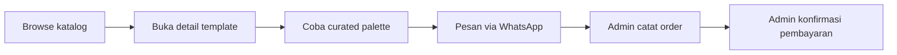
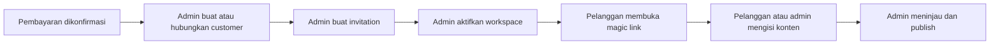
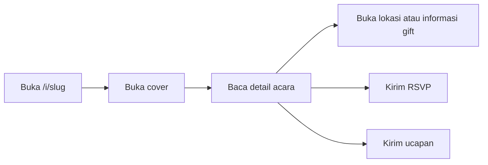

# PRD: MVP Undango

**Status:** Approved  
**Versi:** 0.2  
**Tanggal:** 2 Agustus 2026  
**Disetujui:** 2 Agustus 2026 oleh product owner  
**Sumber visi produk:** [`docs/PRODUCT.md`](./PRODUCT.md)  
**Target pasar:** Pasangan di Indonesia yang membutuhkan undangan pernikahan digital siap pakai.

## 1. Objective

Undango adalah layanan undangan pernikahan digital berbasis template. Produk membantu pasangan menemukan desain yang sesuai, melihat hasil realistis sebelum membeli, memesan melalui WhatsApp, lalu menyelesaikan konten undangan melalui workspace privat dengan bantuan admin bila dibutuhkan.

MVP harus membuktikan tiga hal:

1. Koleksi template berkualitas dapat menarik minat calon pelanggan.
2. Preview dan CTA WhatsApp dapat mengubah minat menjadi percakapan order tanpa checkout otomatis.
3. Alur operasional manual dan workspace pelanggan dapat menghasilkan invitation yang siap dibagikan tanpa editor desain bebas.

### 1.1 Pengguna

| Peran | Kebutuhan utama | Hasil yang diharapkan |
|---|---|---|
| Pengunjung | Menilai template sebelum memberikan data atau membuat akun | Menemukan template dan palette yang disukai, lalu menghubungi admin melalui WhatsApp |
| Pelanggan | Menyelesaikan dan merevisi invitation yang dibeli | Mengelola konten sendiri melalui akses privat atau meminta bantuan admin |
| Admin | Mengelola order, membantu pelanggan, dan menjaga kualitas publish | Mengaktifkan workspace dan menjadi satu-satunya pihak yang dapat publish atau unpublish |
| Tamu | Membaca invitation dan merespons | Membuka invitation published, mengirim RSVP, serta menulis ucapan |

Satu pelanggan dapat memiliki lebih dari satu order atau invitation.

### 1.2 Nilai produk

> Undangan siap pakai yang cantik, mudah dipersonalisasi, dan siap dibagikan.

Produk bukan editor desain bebas, marketplace vendor, wedding organizer, atau sistem checkout otomatis.

## 2. Keputusan dan Asumsi

Keputusan berikut sudah dikonfirmasi untuk PRD ini:

| Area | Keputusan |
|---|---|
| Cakupan | Seluruh MVP: showroom, operasional admin, workspace pelanggan, dan invitation publik |
| Platform | Satu aplikasi web responsive dan mobile-first |
| Pemesanan | Percakapan serta pembayaran ditangani manual melalui WhatsApp |
| Pencatatan lead | Admin mencatat lead dan order secara manual; WhatsApp API tidak digunakan |
| Publish | Hanya admin dapat publish, unpublish, atau archive invitation |
| Edit setelah publish | Customer tetap dapat mengedit; setelah peringatan dikonfirmasi, save langsung terlihat publik |
| RSVP dan ucapan | Form publik tanpa login dengan validasi dan proteksi abuse |
| Target kualitas | Target minimum MVP; tidak ada ambang formal WCAG atau Core Web Vitals pada rilis awal |
| Bahasa dan mata uang | Antarmuka utama Bahasa Indonesia dan harga Rupiah |
| Persistence | PostgreSQL dengan Prisma ORM |
| Asset storage | Filesystem VPS tanpa provider object storage tambahan pada MVP |
| Passwordless access | Magic link reusable selama 24 jam; recovery memakai PIN email 6 digit yang berlaku 10 menit dan menghasilkan sesi 24 jam |
| Order lifecycle | `requested`, `payment_pending`, `paid`, `cancelled`, dan `refunded` |
| Template management | Implementasi template dan palette berada di source code; admin hanya dapat hide atau unhide |
| Retensi | Tidak ada expiry otomatis; invitation live sampai admin archive dan data dihapus manual |
| Testing | Vitest dan Testing Library untuk unit/component; Playwright untuk end-to-end |
| Target bisnis | Baseline dikumpulkan 30 hari pertama sebelum target funnel ditetapkan |

Pilihan provider analytics, email delivery, backup VPS, serta detail deployment diputuskan pada Phase 2 (Plan) tanpa mengubah requirement produk.

## 3. Prinsip Produk

| Prinsip | Requirement |
|---|---|
| Template dulu | Katalog dan preview menjadi pintu masuk utama |
| Friksi rendah | Pengunjung tidak wajib login, checkout, atau mengisi data pernikahan sebelum menghubungi admin |
| Personalisasi aman | Pelanggan hanya dapat mengubah konten dan opsi desain yang dikurasi |
| Hybrid self-service | Pelanggan dan admin dapat mengisi konten; publish tetap dikendalikan admin |
| Mobile-first | Showroom, workspace, dan invitation harus usable pada ponsel |
| Privat sampai publish | Draft tidak dapat diakses melalui route publik atau token edit permanen |

## 4. Scope MVP

### 4.1 Termasuk

- 3-5 template matang dengan kategori, harga, data demo realistis, dan 3-6 palette per template.
- Katalog publik, detail template, interactive preview, dan CTA WhatsApp berkonteks.
- Dashboard admin untuk pencatatan order manual, activation, bantuan edit, pengelolaan publish, serta pengelolaan RSVP dan ucapan.
- Workspace pelanggan passwordless dengan form, upload foto, curated palette, dan live preview.
- Invitation publik dengan section standar, RSVP, ucapan, wedding gift, musik opsional, dan animasi ringan.
- Analytics dasar untuk funnel showroom, order, publish, dan penggunaan invitation.

### 4.2 Tidak termasuk

- Payment gateway, cart, checkout otomatis, invoice otomatis, dan subscription billing.
- WhatsApp API, auto-reply, sinkronisasi percakapan, dan automasi order.
- Drag-and-drop canvas, custom CSS, free color picker, serta font bebas.
- Marketplace template, marketplace vendor, wedding planner, dan table management.
- AI pembuat desain atau konten invitation.
- Moderation queue untuk ucapan; customer dan admin tetap dapat hide atau delete ucapan secara individual.
- Pencarian template berbasis prompt; fitur ini hanya kandidat fase berikutnya.

## 5. User Journeys

### 5.1 Discovery dan Pemesanan



Kriteria journey:

- Pengunjung dapat menyelesaikan alur sampai WhatsApp tanpa login.
- Preview menampilkan invitation demo lengkap, bukan form kosong.
- Pesan WhatsApp membawa nama template, harga saat ini, palette terpilih, dan URL detail template.
- Kegagalan membuka aplikasi WhatsApp tetap menyediakan URL WhatsApp Web yang valid.

### 5.2 Activation dan Pengisian



Kriteria journey:

- Invitation dan akses workspace tidak diaktifkan sebelum pembayaran dikonfirmasi.
- Magic link dapat digunakan berulang selama 24 jam dan hanya memberi akses ke invitation milik pelanggan terkait.
- Setelah magic link kedaluwarsa, customer dapat meminta PIN 6 digit melalui email; PIN berlaku 10 menit dan sesi hasil verifikasi berlaku 24 jam.
- Pelanggan dapat menyimpan perubahan dan kembali mengedit selama akses aktif.
- Pelanggan tidak melihat aksi publish; kesiapan publish dikoordinasikan dengan admin melalui kanal operasional.
- Jika invitation sudah published, workspace memperingatkan bahwa save berikutnya langsung mengubah halaman publik.

### 5.3 Pengalaman Tamu



Kriteria journey:

- Hanya invitation berstatus `published` yang dapat dibuka melalui route publik.
- Informasi utama tetap terbaca jika musik, animasi, atau JavaScript tambahan gagal berjalan.
- RSVP dan ucapan memberikan status sukses atau error yang jelas dan mencegah submit ganda saat request berjalan.

## 6. Functional Requirements

### 6.1 Showroom Publik

| ID | Requirement | Acceptance criteria |
|---|---|---|
| `SHW-001` | Katalog menampilkan template aktif | Setiap kartu menampilkan nama, kategori, thumbnail, dan harga Rupiah; template nonaktif tidak muncul |
| `SHW-002` | Katalog mendukung filter kategori | Pengunjung dapat memilih kategori dan mengembalikan tampilan ke semua kategori tanpa reload penuh |
| `SHW-003` | Detail template memakai data demo realistis | Preview memuat nama, tanggal, venue, foto, dan section representatif yang cukup untuk menilai hasil akhir |
| `SHW-004` | Setiap template menyediakan curated palette | Tersedia 3-6 palette; hanya palette milik template tersebut yang dapat dipilih |
| `SHW-005` | Pergantian palette memperbarui preview | Warna preview berubah segera tanpa mengubah struktur, font pairing, atau konten demo |
| `SHW-006` | Harga tampil konsisten | Harga pada kartu, detail, dan pesan WhatsApp berasal dari data template yang sama |
| `SHW-007` | CTA WhatsApp membawa konteks order | Pesan berisi nama template, harga, palette terpilih, dan URL detail; CTA dapat digunakan pada ponsel dan desktop |
| `SHW-008` | Showroom dapat dibuka tanpa autentikasi | Katalog dan detail template tidak mengarahkan pengguna ke login atau form data pernikahan |
| `SHW-009` | Interaksi funnel tercatat | View detail, pilihan palette, dan klik CTA menghasilkan event analytics vendor-neutral yang ditentukan pada bagian Analytics |

### 6.2 Order dan Operasional Admin

| ID | Requirement | Acceptance criteria |
|---|---|---|
| `ADM-001` | Admin dapat mencatat lead atau order WhatsApp secara manual | Catatan minimal menghubungkan kontak customer, template, palette, harga yang disepakati, batas jumlah foto, dan status pembayaran |
| `ADM-002` | Order menyimpan price snapshot | Perubahan harga template setelah order dibuat tidak mengubah harga order lama |
| `ADM-003` | Admin dapat mencari dan membuka customer | Admin dapat melihat seluruh order dan invitation milik customer yang sama |
| `ADM-004` | Admin dapat mengonfirmasi pembayaran manual | Konfirmasi menyimpan waktu dan aktor; hanya order terkonfirmasi yang dapat menghasilkan invitation aktif |
| `ADM-005` | Admin dapat membuat invitation dari order | Invitation memakai template dan palette order, memiliki customer owner, serta slug unik |
| `ADM-006` | Admin dapat mengaktifkan akses workspace | Admin dapat membuat magic link yang reusable selama 24 jam, mengirimkannya melalui kanal yang dipilih, serta revoke atau rotate link sebelum TTL berakhir |
| `ADM-007` | Admin dapat mengedit seluruh konten invitation | Perubahan admin memakai aturan validasi yang sama dengan perubahan pelanggan dan menyimpan waktu serta aktor terakhir |
| `ADM-008` | Hanya admin dapat mengubah visibilitas publik | Pelanggan tidak dapat publish, unpublish, atau archive melalui UI maupun endpoint |
| `ADM-009` | Admin dapat mengelola RSVP dan ucapan | Data dapat difilter per invitation dan menampilkan waktu submit; admin dapat hide, unhide, atau delete ucapan |
| `ADM-010` | Admin mendapat ringkasan operasional | Dashboard menampilkan order menurut status, invitation menurut status, serta data dasar conversion dan engagement |
| `ADM-011` | Admin dapat hide atau unhide template | Aksi hanya mengubah visibilitas katalog; kode layout, palette, demo content, dan harga tidak dapat diedit dari dashboard |
| `ADM-012` | Order mengikuti lifecycle yang ditetapkan | Status valid adalah `requested`, `payment_pending`, `paid`, `cancelled`, dan `refunded`; activation invitation hanya tersedia dari order `paid` |

### 6.3 Workspace Pelanggan

| ID | Requirement | Acceptance criteria |
|---|---|---|
| `WSP-001` | Workspace memerlukan autentikasi passwordless yang sah | Magic link kuat dapat dipakai berulang selama 24 jam; setelah expiry, PIN email 6 digit berlaku 10 menit dengan maksimal 5 percobaan per 15 menit; verifikasi sukses menghasilkan secure session 24 jam |
| `WSP-002` | Akses dibatasi per invitation | Customer tidak dapat membaca atau mengubah invitation milik customer lain dengan mengganti ID atau URL |
| `WSP-003` | Pelanggan dapat mengubah konten yang diizinkan | Form mencakup nama mempelai dan orang tua, copy, quote, detail acara, venue, tautan Maps, foto, musik, palette, gift, serta konten section |
| `WSP-004` | Struktur desain tetap dikunci | Pelanggan tidak dapat mengubah layout utama, posisi ornamen, CSS, warna di luar palette, atau font di luar opsi template |
| `WSP-005` | Workspace menyediakan live preview | Perubahan form yang valid terlihat pada preview template yang sama; pada invitation published, save yang dikonfirmasi langsung memperbarui halaman publik |
| `WSP-006` | Perubahan dapat disimpan dan dipulihkan | Setelah status sukses tampil, refresh atau login ulang menampilkan data terakhir yang berhasil disimpan |
| `WSP-007` | Upload foto aman dan terikat invitation | Foto hanya JPEG, PNG, atau WebP maksimal 10 MB per file dan diproses maksimal 2560 px; audio hanya MP3 atau M4A maksimal 15 MB dan 10 menit; jumlah foto tidak boleh melebihi snapshot order |
| `WSP-008` | Konflik perubahan tidak menimpa diam-diam | Jika data berubah sejak form dibuka, pelanggan atau admin mendapat peringatan sebelum versi lama menimpa versi baru |
| `WSP-009` | Pelanggan dapat meminta bantuan admin | Workspace menampilkan jalur WhatsApp yang membawa konteks invitation tanpa memberi hak publish |
| `WSP-010` | Error tidak menghilangkan input | Kegagalan validasi atau jaringan menampilkan error yang dapat ditindaklanjuti dan mempertahankan input lokal saat aman dilakukan |
| `WSP-011` | Edit published memerlukan peringatan eksplisit | Sebelum save pertama pada invitation published, customer harus mengonfirmasi bahwa perubahan akan langsung terlihat publik; warning tidak memberi hak publish atau unpublish |
| `WSP-012` | Customer dapat mengelola respons invitation miliknya | Customer dapat melihat RSVP serta hide, unhide, atau delete ucapan pada invitation miliknya, tanpa dapat mengakses respons invitation lain |

### 6.4 Invitation Publik

| ID | Requirement | Acceptance criteria |
|---|---|---|
| `INV-001` | Route publik memakai `/i/[slug]` | Slug unik membuka invitation terkait hanya ketika status `published` |
| `INV-002` | Draft tidak bocor | Status selain `published` menghasilkan respons not found atau hasil setara yang tidak mengungkap konten, customer, maupun status internal |
| `INV-003` | Invitation menyediakan struktur konten standar | Mendukung cover, pembuka, mempelai, countdown, detail acara, lokasi, galeri, cerita, RSVP, gift, ucapan, dan penutup |
| `INV-004` | Section opsional tidak meninggalkan ruang rusak | Section tanpa data tidak dirender atau menampilkan fallback yang sengaja dirancang |
| `INV-005` | Lokasi terhubung ke Google Maps | Tautan lokasi valid dapat dibuka dari perangkat mobile tanpa menghalangi informasi alamat tertulis |
| `INV-006` | Musik mengikuti batasan browser | Audio hanya dimulai setelah interaksi pengguna bila autoplay diblokir dan selalu menyediakan kontrol pause |
| `INV-007` | Animasi tidak menghambat informasi | Konten tetap dapat dibaca saat animasi dimatikan, gagal, atau preferensi reduced motion aktif |
| `INV-008` | Wedding gift menampilkan data terstruktur | Informasi rekening atau metode gift hanya tampil ketika diaktifkan dan tidak meminta data pembayaran tamu |
| `INV-009` | Perubahan status langsung mengontrol akses | Publish membuat route tersedia; unpublish atau archive menutup route publik tanpa menghapus data invitation |
| `INV-010` | Invitation tidak kedaluwarsa otomatis | Invitation tetap live sampai admin melakukan unpublish atau archive; tidak ada job expiry atau penghapusan otomatis pada MVP |

### 6.5 RSVP dan Ucapan

| ID | Requirement | Acceptance criteria |
|---|---|---|
| `GST-001` | Tamu dapat mengirim RSVP tanpa login | Form hanya tersedia pada invitation published; nama maksimal 100 karakter, status hadir wajib, jumlah tamu dibatasi konfigurasi invitation, dan pilihan acara hanya muncul bila invitation memiliki beberapa acara |
| `GST-002` | Tamu dapat mengirim ucapan tanpa login | Nama maksimal 100 karakter dan ucapan maksimal 1.000 karakter divalidasi, disanitasi, dan dikaitkan dengan invitation yang benar |
| `GST-003` | Endpoint memvalidasi input di server | Payload kosong, terlalu panjang, tidak sesuai format, atau memiliki field tak diizinkan ditolak dengan pesan aman |
| `GST-004` | Endpoint memiliki proteksi abuse | Rate limit dan honeypot aktif; CAPTCHA dapat diminta saat pola traffic mencurigakan |
| `GST-005` | Submit idempotent dari UI | Tombol dinonaktifkan selama request dan retry tidak membuat duplikat tanpa tindakan sadar pengguna |
| `GST-006` | Data tamu tidak masuk payload analytics | Event hanya membawa invitation ID internal dan hasil submit, bukan nama, nomor telepon, ucapan, atau detail personal lain |
| `GST-007` | Pemilik dan admin dapat mengelola ucapan | Hide bersifat reversible; delete memerlukan konfirmasi eksplisit dan menghapus ucapan dari tampilan serta dashboard |

## 7. Lifecycle dan Authorization

### 7.1 Lifecycle

| Entitas | Status | Makna | Akses |
|---|---|---|---|
| Order | `requested` | Lead WhatsApp sudah dicatat | Admin |
| Order | `payment_pending` | Order menunggu konfirmasi pembayaran manual | Admin |
| Order | `paid` | Pembayaran dikonfirmasi dan invitation dapat dibuat | Admin |
| Order | `cancelled` | Order dibatalkan sebelum selesai | Admin |
| Order | `refunded` | Pembayaran dikembalikan dan tindak lanjut invitation ditangani admin | Admin |
| Invitation | `activated` | Invitation dibuat dan workspace dapat diaktifkan | Customer terkait dan admin |
| Invitation | `editing` | Konten sedang diisi atau direvisi | Customer terkait dan admin |
| Invitation | `published` | Invitation tersedia melalui `/i/[slug]`; save customer langsung memperbarui versi publik setelah warning dikonfirmasi | Publik untuk membaca; customer terkait dan admin untuk workspace |
| Invitation | `archived` | Invitation ditutup dari publik dan dipertahankan tanpa expiry otomatis | Admin; customer dapat mengakses kembali hanya jika admin mengaktifkan akses |

Status `order_requested` dari `PRODUCT.md` dinormalkan menjadi Order `requested`. Invitation baru dibuat setelah Order berstatus `paid`, sehingga Invitation tidak memiliki status pre-payment.

### 7.2 Matriks Hak Akses

| Aksi | Pengunjung | Customer pemilik | Customer lain | Admin | Tamu |
|---|---:|---:|---:|---:|---:|
| Melihat katalog dan preview | Ya | Ya | Ya | Ya | Ya |
| Melihat workspace | Tidak | Ya | Tidak | Ya | Tidak |
| Mengedit konten | Tidak | Ya | Tidak | Ya | Tidak |
| Mengubah template dasar | Tidak | Tidak | Tidak | Sesuai kebijakan order | Tidak |
| Publish, unpublish, archive | Tidak | Tidak | Tidak | Ya | Tidak |
| Melihat invitation published | Ya | Ya | Ya | Ya | Ya |
| Mengirim RSVP atau ucapan | Ya | Ya | Ya | Ya | Ya |
| Melihat RSVP atau ucapan invitation sendiri | Tidak | Ya | Tidak | Ya | Tidak |
| Hide, unhide, atau delete ucapan | Tidak | Ya, milik invitation sendiri | Tidak | Ya | Tidak |

Semua pemeriksaan authorization wajib dilakukan di server. Menyembunyikan kontrol UI saja tidak cukup.

## 8. Data Requirements

| Entitas | Data minimum | Invariant |
|---|---|---|
| `Template` | ID, slug, nama, kategori, deskripsi, harga aktif, status katalog, data demo | Template nonaktif tidak muncul di showroom; perubahan harga tidak mengubah order lama |
| `TemplatePalette` | ID, template ID, nama, token warna terkurasi, status | Palette hanya valid untuk satu template |
| `Customer` | ID, nama, kontak WhatsApp dan/atau email, status | Satu customer dapat memiliki banyak order dan invitation |
| `Order` | ID, customer, template, palette, price snapshot, batas jumlah foto, status, timestamps | Status hanya `requested`, `payment_pending`, `paid`, `cancelled`, atau `refunded`; invitation aktif tidak dibuat sebelum status `paid` |
| `Invitation` | ID, customer, order, template, palette, slug, status, publish timestamps | Slug unik; hanya `published` yang tersedia secara publik |
| `InvitationContent` | Data terstruktur per section dan revision metadata | Konten harus mengikuti schema template dan mencatat aktor serta waktu perubahan terakhir |
| `Asset` | ID, invitation, jenis, path internal VPS, metadata, status | File disimpan di luar direktori publik langsung; akses draft tetap invitation-scoped dan upload divalidasi |
| `RSVP` | ID, invitation, nama, kehadiran, jumlah tamu, acara opsional, timestamp | Hanya dapat dibuat untuk invitation published dan tidak menyimpan nomor kontak |
| `Wish` | ID, invitation, nama, isi tersanitasi, visibility, timestamp | Hanya dapat dibuat untuk invitation published; hide reversible dan delete memerlukan konfirmasi |

Data model tidak boleh menyimpan harga order sebagai referensi dinamis ke harga template. Data personal dan token autentikasi tidak boleh dikirim ke analytics.

## 9. Analytics

### 9.1 Event Minimum

| Event | Dipicu saat | Properti minimum non-PII |
|---|---|---|
| `template_list_viewed` | Katalog berhasil tampil | Kategori aktif |
| `template_detail_viewed` | Detail template berhasil tampil | Template ID, kategori |
| `template_palette_selected` | Pengunjung memilih palette | Template ID, palette ID |
| `whatsapp_cta_clicked` | CTA WhatsApp ditekan | Template ID, palette ID, price tier |
| `order_recorded` | Admin menyimpan order | Template ID, palette ID, price tier |
| `order_activated` | Pembayaran dikonfirmasi dan invitation aktif | Template ID, durasi dari order |
| `workspace_saved` | Perubahan workspace berhasil disimpan | Invitation ID internal, actor role |
| `invitation_published` | Admin publish | Invitation ID internal, durasi dari activation |
| `invitation_viewed` | Invitation published berhasil tampil | Invitation ID internal |
| `rsvp_submitted` | RSVP valid tersimpan | Invitation ID internal, result |
| `wish_submitted` | Ucapan valid tersimpan | Invitation ID internal, result |

### 9.2 Indikator

- Klik CTA WhatsApp per template dan palette.
- Rasio detail template ke klik WhatsApp.
- Rasio order tercatat ke activation.
- Waktu dari order ke activation dan dari activation ke publish.
- Jumlah save customer dibanding save admin sebagai indikator self-service.
- View, RSVP, dan ucapan per invitation published.

Target angka bisnis belum ditentukan. MVP mengumpulkan baseline selama 30 hari pertama setelah launch, lalu owner produk menetapkan target detail-to-WhatsApp conversion, activation rate, dan waktu sampai publish berdasarkan data tersebut.

## 10. Non-Functional Requirements

### 10.1 Usability dan Responsive

- Alur utama harus usable pada viewport ponsel mulai lebar 360 px dan desktop modern.
- Informasi utama tidak boleh membutuhkan hover.
- Form harus memiliki label, pesan error, urutan fokus yang masuk akal, dan kontrol yang dapat digunakan dengan keyboard.
- Preview boleh disederhanakan pada perangkat kecil selama hasil visual template tetap representatif.

### 10.2 Performance Minimum MVP

- Showroom dan invitation tidak boleh menunggu audio, animasi, analytics, atau gambar galeri non-kritis untuk menampilkan konten utama.
- Gambar harus memakai ukuran responsif dan format yang sesuai.
- Animasi harus ringan serta menghormati `prefers-reduced-motion`.
- Build production tidak boleh memiliki error atau warning yang menunjukkan route utama gagal dirender.
- Ambang Core Web Vitals formal ditunda sampai baseline produksi tersedia.

### 10.3 Security dan Privacy

- Semua input divalidasi di server dan output buatan pengguna disanitasi sebelum dirender.
- Authorization invitation-scoped diterapkan di server untuk setiap read dan write privat.
- Magic link harus dapat kedaluwarsa dan dicabut; token mentah tidak disimpan dalam log atau analytics.
- Magic link reusable memiliki accepted replay risk selama TTL 24 jam; token harus memiliki entropy tinggi, hanya dikirim melalui HTTPS, dan dapat di-rotate segera jika diduga bocor.
- PIN email berlaku 10 menit, maksimal 5 percobaan per 15 menit, dan respons request PIN tidak boleh membocorkan apakah email terdaftar.
- Endpoint publik RSVP dan ucapan memakai rate limit, honeypot, dan CAPTCHA adaptif bila diperlukan.
- Upload membatasi tipe, ukuran, dan jumlah file serta tidak mempercayai MIME type dari client saja.
- Secret, credential, dan data pribadi tidak boleh masuk repository, client bundle, URL analytics, atau log publik.
- Route draft harus gagal tertutup: error authorization tidak boleh membuat konten menjadi publik.

### 10.4 Reliability dan Data Integrity

- Operasi save, activation, dan publish memberikan hasil sukses atau gagal yang eksplisit.
- Publish tidak boleh menghasilkan halaman publik setengah tersimpan.
- Perubahan bersamaan harus terdeteksi agar update lama tidak menimpa update baru tanpa peringatan.
- Timestamp order, activation, publish, dan perubahan konten disimpan untuk audit dasar.

### 10.5 Asset Storage

- Foto dan musik disimpan pada filesystem VPS di luar direktori static public aplikasi.
- Akses asset draft harus melalui pemeriksaan status invitation dan authorization; path filesystem tidak boleh menjadi public identifier.
- Invitation published dapat menyajikan asset melalui URL terkontrol tanpa membuka asset invitation lain.
- VPS harus memiliki monitoring kapasitas disk dan backup; frekuensi backup serta recovery objective ditetapkan pada implementation plan.
- Invitation, asset, RSVP, dan ucapan tidak memiliki expiry otomatis; penghapusan manual harus eksplisit dan terotorisasi.

### 10.6 Compatibility dan Locale

- Browser target minimum: versi stabil modern Chrome dan Safari pada mobile serta Chrome, Safari, Firefox, dan Edge pada desktop.
- Tanggal, waktu, nomor, dan harga ditampilkan sesuai locale Indonesia.
- Zona waktu acara disimpan secara eksplisit dan tidak diasumsikan selalu WIB.
- Konten antarmuka MVP memakai Bahasa Indonesia; konten invitation mengikuti input customer.

## 11. Tech Stack

Stack yang sudah ada dan menjadi baseline repository:

| Area | Teknologi | Versi atau status |
|---|---|---|
| Framework | Next.js App Router | 16.2.12 |
| UI | React | 19.2.4 |
| Bahasa | TypeScript strict | 5.x |
| Styling | Tailwind CSS | 4.x |
| Lint | ESLint dengan Next.js Core Web Vitals dan TypeScript | 9.x |
| Package manager | pnpm | Lockfile tersedia |
| Database | PostgreSQL | Versi ditetapkan pada planning sesuai dukungan VPS dan Prisma |
| ORM | Prisma | Approved, belum terpasang |
| Asset storage | Filesystem VPS | Approved untuk MVP |
| Unit/component test | Vitest dan Testing Library | Approved, belum terpasang |
| Browser automation | Playwright | Approved, belum terpasang |

Email delivery provider, analytics provider, versi PostgreSQL, dan detail deployment VPS belum diputuskan. Object storage eksternal tidak digunakan pada MVP.

## 12. Commands

| Kebutuhan | Command | Status |
|---|---|---|
| Install dependency | `pnpm install --frozen-lockfile` | Tersedia |
| Development | `pnpm dev` | Tersedia |
| Production build | `pnpm build` | Tersedia |
| Production server | `pnpm start` | Tersedia setelah build |
| Lint | `pnpm lint` | Tersedia |
| Unit dan component test | `pnpm test` | Target script Vitest; belum tersedia |
| End-to-end test | `pnpm test:e2e` | Target script Playwright; belum tersedia |

## 13. Project Structure

Struktur baseline dan lokasi target:

```text
src/app/                 Next.js routes, layouts, dan route handlers
src/components/          Komponen UI lintas route (dibuat saat dibutuhkan)
src/features/            Modul per domain produk (dibuat saat dibutuhkan)
src/lib/                 Utilitas dan integrasi lintas domain (dibuat saat dibutuhkan)
public/                  Asset publik statis
prisma/                  Prisma schema dan migration
docs/                    Product definition, PRD, dan dokumentasi keputusan
tests/                   Integration tests lintas modul (target)
e2e/                     End-to-end tests untuk journey kritis (target)
```

Unit dan component test ditempatkan dekat source sebagai `*.test.ts` atau `*.test.tsx`. Struktur final mengikuti implementation plan yang disetujui dan tidak boleh membuat abstraction kosong sebelum ada kebutuhan.

## 14. Code Style

Gunakan TypeScript strict, nama `camelCase` untuk nilai dan fungsi, `PascalCase` untuk komponen serta type, import internal melalui alias `@/`, double quote, dan semicolon. Validasi input pada boundary; business rule tidak diletakkan hanya di komponen UI.

```ts
type WhatsAppOrderContext = {
  templateName: string;
  paletteName: string;
  priceInRupiah: number;
  templateUrl: string;
};

export function buildWhatsAppOrderMessage(
  context: WhatsAppOrderContext,
): string {
  const price = new Intl.NumberFormat("id-ID", {
    style: "currency",
    currency: "IDR",
    maximumFractionDigits: 0,
  }).format(context.priceInRupiah);

  return `Saya tertarik dengan ${context.templateName} (${context.paletteName}) seharga ${price}. ${context.templateUrl}`;
}
```

## 15. Testing Strategy

Vitest, Testing Library, dan Playwright sudah dipilih tetapi belum terpasang. Setup test runner dan scripts menjadi task pertama sebelum implementasi behavior.

| Level | Fokus | Lokasi target |
|---|---|---|
| Unit | Price snapshot, validasi, lifecycle, authorization policy, formatter, dan WhatsApp message builder dengan Vitest | Dekat source sebagai `*.test.ts` |
| Component | Form state, palette selector, preview, warning edit live, error state, dan accessible controls dengan Testing Library | Dekat component sebagai `*.test.tsx` |
| Integration | Auth passwordless, invitation-scoped access, persistence, upload policy, publish visibility, RSVP, dan abuse protection | `tests/` |
| End-to-end | Discovery ke WhatsApp, activation ke workspace, admin publish, warning edit live, akses draft ditolak, RSVP, dan ucapan dengan Playwright | `e2e/` |
| Manual | Visual quality setiap template pada mobile, musik, animasi, Maps, dan WhatsApp deep link pada perangkat nyata | Checklist release |

Coverage requirement:

- Seluruh cabang aturan authorization, lifecycle, price snapshot, dan visibilitas publish harus diuji.
- Setiap bug behavior wajib memiliki regression test.
- Threshold coverage global ditetapkan setelah framework dan baseline test tersedia; tidak boleh dipakai sebagai pengganti pengujian journey kritis.
- `pnpm lint`, `pnpm test`, `pnpm test:e2e`, dan `pnpm build` wajib lulus sebelum perubahan fitur dianggap selesai.

## 16. Boundaries

### Always Do

- Pertahankan katalog dan preview tanpa login.
- Validasi input dan authorization di server.
- Simpan price snapshot pada order.
- Batasi opsi pelanggan pada konfigurasi template yang dikurasi.
- Pastikan hanya admin dapat publish, unpublish, dan archive.
- Tampilkan warning sebelum customer menyimpan perubahan pada invitation published karena hasilnya langsung live.
- Batasi upload sesuai snapshot order dan simpan asset di luar direktori publik VPS.
- Jalankan lint, test, dan build sebelum merge.
- Perbarui PRD sebelum mengubah scope atau business rule yang sudah disetujui.

### Ask First

- Mengubah lifecycle order atau invitation.
- Mengubah database schema atau strategi migrasi setelah data produksi ada.
- Menambah dependency, provider eksternal, tracking, atau layanan berbayar.
- Mengubah auth, expiry magic link, kebijakan retensi, atau izin peran.
- Mengganti filesystem VPS dengan object storage eksternal.
- Mengubah CI/CD, deployment, domain, atau kebijakan storage.
- Menambahkan field data pribadi atau mengirim data ke pihak ketiga.

### Never Do

- Membuat draft dapat diakses melalui route publik.
- Memberi customer hak publish melalui UI atau endpoint.
- Menjalankan expiry atau penghapusan data otomatis tanpa perubahan PRD dan persetujuan owner.
- Menyimpan token mentah, secret, credential, atau data pribadi di log dan analytics.
- Mengubah harga order lama saat harga template berubah.
- Menambahkan free-form design editor, checkout otomatis, atau WhatsApp automation pada MVP.
- Menghapus test gagal untuk membuat pipeline lulus tanpa persetujuan.
- Mengedit `node_modules/`, `.next/`, atau generated files secara manual.

## 17. Success Criteria

MVP siap ditinjau untuk rilis ketika seluruh kondisi berikut terpenuhi:

- 3-5 template aktif tersedia; masing-masing memiliki kategori, data demo realistis, harga, dan 3-6 palette.
- Pengunjung dapat browse, mencoba palette, dan membuka pesan WhatsApp lengkap tanpa login.
- Admin dapat mencatat order manual, mengonfirmasi pembayaran, membuat invitation, dan mengaktifkan akses customer.
- Customer dapat mengakses hanya invitation miliknya, mengubah seluruh field yang diizinkan, upload foto, melihat preview, dan menyimpan perubahan.
- Customer tidak dapat mengubah struktur desain atau melakukan publish melalui UI maupun direct request.
- Customer yang mengedit invitation published menerima warning eksplisit; save terkonfirmasi langsung terlihat pada halaman publik.
- Admin dapat membantu edit serta publish, unpublish, atau archive invitation.
- Hanya invitation `published` yang tersedia pada `/i/[slug]`; seluruh status lain tidak membocorkan konten.
- Invitation published menampilkan section terisi dengan benar pada mobile dan desktop modern.
- RSVP non-PII serta ucapan valid dapat tersimpan; input invalid, spam dasar, dan request berlebih ditolak.
- Customer pemilik dan admin dapat melihat RSVP serta hide, unhide, atau delete ucapan sesuai scope akses.
- Asset tersimpan pada filesystem VPS dengan validasi upload, access control draft, disk monitoring, dan backup yang teruji.
- Event analytics minimum tercatat tanpa payload PII dan dapat dipakai menghitung indikator awal.
- Journey kritis memiliki automated test; visual template, Maps, audio, animasi, dan WhatsApp diverifikasi manual pada perangkat nyata.
- `pnpm lint`, `pnpm test`, `pnpm test:e2e`, dan `pnpm build` lulus pada revision release.

## 18. Open Questions

Tidak ada open question produk yang tersisa. Keputusan teknis berikut sengaja didelegasikan ke Phase 2 (Plan) dan harus mengikuti requirement PRD:

1. Pilih provider pengiriman email untuk PIN dengan opsi gratis yang cukup untuk MVP, delivery monitoring, dan rate limiting.
2. Pilih analytics provider dengan opsi gratis, event contract vendor-neutral, tanpa payload PII, serta consent sesuai mekanisme tracking yang dipakai.
3. Tetapkan versi PostgreSQL dan Prisma yang kompatibel dengan VPS dan framework.
4. Tetapkan layout direktori asset VPS, backup frequency, restore procedure, disk alert threshold, dan recovery objective.
5. Tetapkan deployment pipeline, HTTPS termination, secret management, dan rollback procedure pada VPS.
6. Setelah 30 hari data produksi tersedia, tetapkan target detail-to-WhatsApp conversion, activation rate, dan waktu sampai publish.

## 19. Approval Gate

Sebelum masuk Phase 2 (Plan), reviewer harus memastikan:

- Objective, scope, dan non-goals sesuai visi produk.
- Requirement serta acceptance criteria dapat diuji.
- Keputusan admin-only publish dan implikasinya terhadap edit setelah publish sudah jelas.
- Keputusan teknis yang didelegasikan memiliki owner dan checkpoint pada implementation plan.
- Human reviewer telah menyatakan approval eksplisit.
- Dokumen berstatus `Approved` dengan tanggal dan reviewer tercatat.
