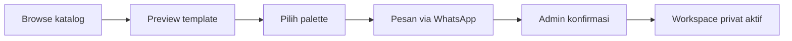

# Product Specification — MVP Undangan Digital Indonesia

**Status:** Draft / source of truth MVP  
**Tanggal:** 2 Agustus 2026  
**Target pasar:** pasangan di Indonesia yang ingin memakai undangan pernikahan digital siap pakai.

## 1. Ringkasan produk

Produk ini adalah layanan undangan pernikahan digital berbasis template. Calon pelanggan dapat menjelajahi template, melihat preview yang realistis, mencoba palette warna yang sudah dikurasi, lalu langsung menghubungi admin melalui WhatsApp saat menemukan template yang disukai.

Setelah pesanan dan pembayaran manual dikonfirmasi, pelanggan memperoleh workspace privat untuk mengisi atau memperbarui detail undangannya sendiri. Pelanggan juga dapat tetap meminta bantuan admin. Produk ini **bukan** editor desain bebas seperti Canva dan **bukan** wedding organizer.

> Posisi produk: **undangan siap pakai yang cantik, mudah dipersonalisasi, dan siap dibagikan.**

## 2. Masalah yang diselesaikan

- Pasangan ingin undangan yang terlihat personal tanpa harus mendesain dari nol.
- Banyak calon pelanggan ingin melihat hasil template secara nyata sebelum mulai mengisi data panjang atau membuat akun.
- Revisi kecil—teks, foto, waktu acara—tidak seharusnya selalu menunggu respons admin.
- Admin tetap dibutuhkan untuk membantu pelanggan yang ingin layanan “terima beres”.

## 3. Tujuan MVP

1. Memvalidasi minat terhadap koleksi template dan kategori desain.
2. Mengubah minat menjadi percakapan WhatsApp secepat mungkin.
3. Menguji proses order, aktivasi, dan delivery undangan tanpa payment gateway.
4. Memberi pelanggan kontrol atas revisi ringan tanpa membebani admin.
5. Menjaga setiap draft tetap privat sampai diaktifkan dan dipublikasikan.

## 4. Prinsip produk

| Prinsip | Implikasi produk |
|---|---|
| Template dulu | Katalog dan preview adalah pintu masuk utama, bukan form pembuatan undangan. |
| Friksi rendah sebelum pembelian | Tidak ada login, form panjang, checkout, atau data pernikahan sebelum pengguna menghubungi admin. |
| Personalisasi yang aman | Pengguna hanya memilih opsi yang sudah dikurasi; tidak ada editor bebas. |
| Hybrid self-service | Pelanggan dapat mengedit sendiri, tetapi admin dapat mengambil alih atau membantu kapan pun dibutuhkan. |
| Mobile-first | Preview dan undangan akhir terutama dirancang untuk dibuka dari WhatsApp di ponsel. |

## 5. Pengguna dan peran

| Peran | Tujuan utama | Akses |
|---|---|---|
| Pengunjung | Mencari template yang cocok | Katalog dan interactive preview publik. |
| Pelanggan | Menyelesaikan dan memperbarui undangan yang dibeli | Workspace privat untuk invitation miliknya. |
| Admin | Menangani order, membantu pelanggan, dan mempublikasikan | Dashboard operasional. |
| Tamu undangan | Melihat undangan dan merespons | Hanya invitation yang sudah published. |

Satu pelanggan dapat memiliki lebih dari satu order atau invitation.

## 6. Pengalaman pelanggan

### 6.1 Discovery dan pemesanan

1. Pengunjung memilih kategori, misalnya Elegant, Minimalist, Jawa, Sumatra, atau tema budaya lainnya.
2. Pengunjung membuka halaman detail template.
3. Halaman menampilkan undangan contoh yang lengkap dengan nama, tanggal, lokasi, foto, dan section yang realistis.
4. Pengunjung mencoba palette yang tersedia untuk template tersebut.
5. Harga ditampilkan pada template, umumnya **Rp100.000** atau **Rp150.000**.
6. CTA utama membuka WhatsApp dengan template, harga, dan palette pilihan yang sudah terisi pada pesan.
7. Admin melanjutkan proses order dan konfirmasi pembayaran secara manual.

Tidak ada halaman pricing terpisah, cart, atau checkout pada MVP.

### 6.2 Setelah pembelian

Setelah pembayaran dikonfirmasi, admin membuat project invitation dan mengirimkan akses passwordless kepada pelanggan.

Pelanggan dapat memilih salah satu jalur berikut:

| Jalur | Pengalaman |
|---|---|
| **Isi sendiri** | Membuka workspace melalui magic link, mengisi data, mengunggah foto, melihat live preview, lalu publish saat siap. |
| **Dibantu admin** | Mengirim detail lewat WhatsApp; admin menyiapkan konten; pelanggan meninjau serta dapat melakukan revisi lanjutan sendiri. |

Magic link digunakan agar pelanggan tidak perlu membuat password sebelum mengakses workspace. Akses edit tidak boleh diberikan melalui URL publik permanen.

## 7. Fitur MVP

### 7.1 Showroom publik

- Katalog template dengan kategori dan harga per template.
- Halaman detail template dengan preview undangan penuh.
- Preview menggunakan data demo yang realistis, bukan placeholder kosong.
- Pilihan 3–6 curated palette per template.
- Tombol **Pesan via WhatsApp** yang membawa konteks template, harga, dan palette terpilih.
- Optimasi untuk layar ponsel dan pembukaan dari WhatsApp.

### 7.2 Workspace pelanggan

Workspace merupakan editor berbasis form dengan preview live. Pelanggan dapat menyimpan perubahan dan kembali mengedit invitation selama aksesnya aktif.

| Pelanggan dapat mengubah | Dikunci oleh template |
|---|---|
| Nama mempelai dan orang tua | Struktur dan urutan layout utama |
| Copywriting, quote, dan pesan pembuka | Posisi ornamen dan komposisi visual |
| Detail acara, tanggal, countdown, venue, dan Google Maps | Warna bebas di luar palette |
| Foto cover dan galeri | Font pairing di luar opsi template |
| Musik | CSS atau elemen custom |
| Curated palette | Desain dasar template |

### 7.3 Dashboard admin

- Melihat dan mengelola lead/order dari WhatsApp.
- Membuat customer dan invitation setelah order dikonfirmasi.
- Mengaktifkan akses workspace pelanggan.
- Membantu mengisi atau merevisi konten invitation.
- Mengatur status invitation dan melakukan publish/unpublish bila diperlukan.
- Melihat RSVP, ucapan, dan data dasar invitation yang sudah aktif.

### 7.4 Invitation publik

Invitation akhir adalah halaman satu arah yang mobile-first. Struktur konten standar:

1. Cover dan tombol buka undangan
2. Pembuka / quote
3. Perkenalan mempelai
4. Save the date dan countdown
5. Detail acara (akad, resepsi, atau acara lain)
6. Lokasi dan Google Maps
7. Galeri foto dan cerita singkat
8. RSVP
9. Wedding gift / informasi rekening
10. Ucapan dan doa
11. Penutup

Undangan dapat memakai musik dan animasi halus yang mendukung kesan elegan; animasi tidak boleh menghambat pembukaan halaman atau mengganggu pembacaan informasi.

## 8. Lifecycle invitation dan privasi

| Status | Siapa yang dapat mengakses | Keterangan |
|---|---|---|
| `order_requested` | Admin | Calon pelanggan sudah menghubungi admin; belum ada akses publik. |
| `activated` | Pelanggan dan admin | Pembayaran manual telah dikonfirmasi; workspace privat aktif. |
| `editing` | Pelanggan dan admin | Konten sedang diisi atau direvisi. |
| `published` | Publik | Invitation dapat dibuka dan dibagikan melalui `/i/[slug]`. |
| `archived` | Admin | Invitation tidak lagi aktif untuk publik. |

Aturan utama:

- Route publik `/i/[slug]` hanya tersedia pada status `published`.
- Draft dan workspace pelanggan tidak boleh dapat dibuka tanpa autentikasi pelanggan/admin yang sah.
- Akses pelanggan hanya berlaku untuk invitation miliknya.
- Admin dapat membantu mengedit seluruh invitation, tetapi perubahan pelanggan tidak boleh tertimpa tanpa alasan yang jelas.

## 9. Entitas produk inti

| Entitas | Tujuan |
|---|---|
| `Template` | Identitas template, kategori, deskripsi, harga, dan status katalog. |
| `Template Palette` | Palette yang diizinkan oleh satu template. |
| `Customer` | Identitas dan kontak pemesan. |
| `Order` | Catatan proses bisnis: template yang diminati, harga yang disepakati, status pembayaran manual. |
| `Invitation` | Produk yang dihasilkan: template terpilih, slug, status, dan pengaturan publish. |
| `Invitation Content` | Data acara, copywriting, foto, palette, dan konfigurasi section. |
| `Asset` | File foto yang diunggah untuk cover atau galeri. |
| `RSVP` dan `Wish` | Respons tamu pada invitation yang sudah published. |

Harga harus disimpan sebagai **price snapshot** pada order. Perubahan harga template di masa depan tidak boleh mengubah harga order yang sudah dibuat.

## 10. Scope awal dan yang ditunda

### Dibangun pada MVP

- 3–5 template yang sangat matang dan mobile-first.
- Katalog, preview interaktif, curated palette, serta CTA WhatsApp.
- Harga per template.
- Admin dashboard untuk order dan activation.
- Customer workspace passwordless dengan form dan live preview.
- Publish URL, RSVP, ucapan, dan analytics dasar.

### Belum dibangun pada MVP

- Payment gateway, checkout otomatis, cart, dan subscription billing.
- WhatsApp API / auto-reply / automasi percakapan.
- Drag-and-drop canvas atau custom design editor.
- Free color picker dan perubahan CSS/font tanpa batas.
- Marketplace template, vendor marketplace, wedding planner, atau table management.
- AI pembuat desain invitation.

**Kandidat fase berikutnya:** pencarian template berbasis prompt yang hanya merekomendasikan template katalog berdasarkan metadata seperti gaya, budaya, dan palette. Fitur ini tidak membuat desain baru.

## 11. Prioritas delivery

1. **Showroom** — koleksi template, preview, palette, harga, dan WhatsApp.
2. **Operasional** — admin dashboard, customer/order/invitation, dan activation.
3. **Workspace** — magic link, form data, upload foto, curated palette, live preview.
4. **Invitation final** — publish, RSVP, ucapan, gift, dan analytics dasar.

## 12. Indikator keberhasilan awal

- Jumlah klik CTA WhatsApp per template.
- Rasio pengunjung halaman detail template yang memulai percakapan WhatsApp.
- Template dan palette yang paling sering diminati.
- Rasio order yang berhasil diaktifkan.
- Waktu rata-rata dari order masuk hingga undangan published.
- Jumlah revisi yang dapat diselesaikan pelanggan tanpa bantuan admin.

## 13. Keputusan yang perlu dijaga saat implementasi

- Kualitas template, bukan jumlah opsi, adalah alasan utama pelanggan membeli.
- WhatsApp adalah jalur conversion awal; jangan memaksa calon pelanggan membuat akun lebih dulu.
- Workspace dibuat untuk revisi dan penyelesaian pasca-pembelian, bukan untuk menggantikan showroom publik.
- Personalisasi harus terasa cukup fleksibel bagi pasangan, tetapi tetap menghasilkan desain yang konsisten dan premium.
