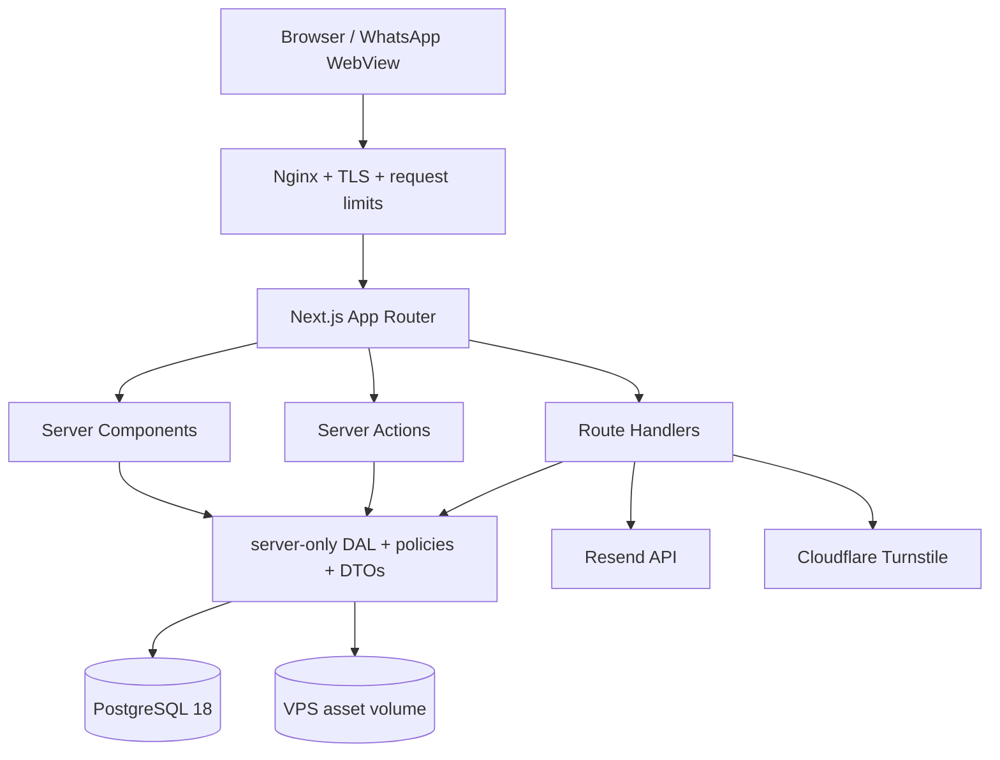
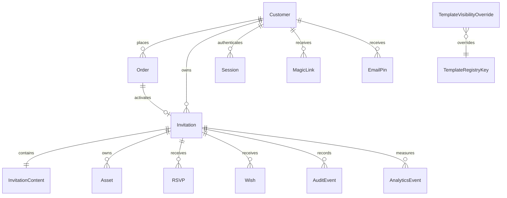
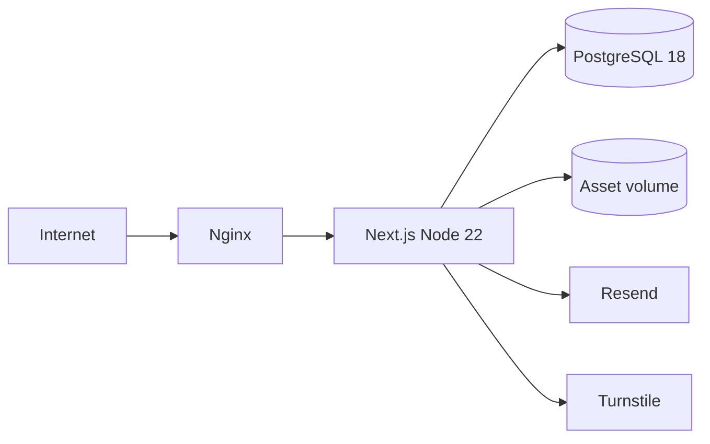
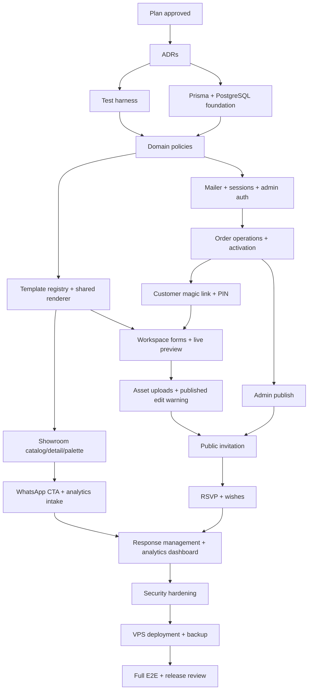

# Implementation Plan: MVP Undango

**Status:** Draft - menunggu review dan approval  
**Tanggal:** 2 Agustus 2026  
**Specification:** [`docs/PRD.md`](../docs/PRD.md) v0.2 Approved  
**Task checklist:** [`tasks/todo.md`](./todo.md)  

## 1. Guardrail

Dokumen ini hanya merencanakan implementasi. Approval plan wajib diperoleh sebelum task implementasi dimulai. Selama Phase 2 tidak boleh ada perubahan pada source aplikasi, dependency, lockfile, database schema, generated files, atau konfigurasi deployment.

## 2. Overview

MVP dibangun sebagai satu aplikasi Next.js App Router yang self-hosted pada satu VPS. Aplikasi melayani empat pengalaman: showroom publik, dashboard admin, workspace customer, dan invitation publik. PostgreSQL menjadi source of truth operasional; template visual tetap source-controlled. Asset customer disimpan pada filesystem persisten VPS dan selalu diakses melalui authorization atau pemeriksaan status invitation.

Delivery mengikuti vertical slice. Showroom diselesaikan lebih dulu, lalu order/activation, workspace, invitation publik, guest responses, analytics, dan production hardening. Setiap slice wajib meninggalkan aplikasi dalam keadaan dapat diuji dan dibangun.

## 3. Proposed Architecture Decisions

Keputusan berikut menjadi final hanya setelah plan disetujui.

| Area | Proposed decision | Rationale dan konsekuensi |
|---|---|---|
| Runtime | Node.js 22.12+ | Memenuhi requirement Prisma 7.6 dan berada pada jalur LTS |
| Framework | Next.js 16.2.12 App Router, React 19.2.4 | Sudah menjadi baseline repository |
| Database | PostgreSQL 18 current minor | Versi supported sampai November 2030; gunakan minor terbaru yang tersedia pada image production |
| ORM | Prisma ORM 7.6 dengan `@prisma/adapter-pg` | Driver adapter wajib pada Prisma 7; migration production memakai `prisma migrate deploy` |
| Application shape | Modular monolith | Satu deployable unit cukup untuk traffic MVP dan menghindari network boundary internal |
| Data access | Server-only Data Access Layer dan minimal DTO | Authorization dekat source data; mencegah raw record atau secret masuk Client Components |
| Mutation | Server Actions untuk form privat; Route Handlers untuk public endpoints, auth callback, upload, dan asset delivery | Mengikuti boundary App Router dan menghindari internal HTTP call dari Server Components |
| Validation | Shared schema validation pada setiap external boundary | Client input, route params, FormData, dan provider response tidak dipercaya |
| Session | Database-backed opaque sessions | Revocable, invitation/customer scoped, dan tidak membawa PII di cookie |
| Email | Resend free plan melalui satu server-only mailer module | Free tier saat plan dibuat: 3.000 email/bulan dan 100/hari; domain pengirim wajib terverifikasi |
| Analytics | First-party event table di PostgreSQL | Tanpa provider, tracking cookie, raw IP, atau external script; biaya tambahan nol |
| Template | Registry source-controlled plus DB visibility override | Layout, palette, demo content, dan harga direview lewat code; admin hanya hide/unhide |
| Invitation content | Relational envelope plus versioned JSON content | Section antar-template dapat berbeda tanpa membebaskan customer dari schema template |
| Asset storage | Filesystem VPS pada `/srv/undango/assets` | Sesuai keputusan zero-additional-cost; memerlukan persistent volume, backup, dan disk monitoring |
| Abuse protection | Nginx request limits, app rate limit, honeypot, dan Cloudflare Turnstile saat threshold terlewati | Layered protection tanpa Redis; Turnstile credential menjadi deployment prerequisite |
| Deployment | Docker Compose, satu app instance, PostgreSQL, dan Nginx + Certbot | Reproducible, HTTPS gratis, persistent volume eksplisit, dan sesuai single-VPS scope |
| Testing | Vitest + Testing Library; Playwright terhadap production build | Sesuai PRD dan dokumentasi Next.js 16; async Server Components diuji melalui E2E |

## 4. Architecture Boundaries



### 4.1 Route Groups

| Route area | Purpose | Rendering/access |
|---|---|---|
| `src/app/(showroom)/` | Home, catalog, dan detail template | Public; Server Components dengan client islands untuk filter dan palette |
| `src/app/admin/` | Order, customer, invitation, responses, dan metrics | Admin session; secure check di DAL setiap read/write |
| `src/app/workspace/` | Customer form dan live preview | Customer session; ownership check pada setiap invitation operation |
| `src/app/i/[slug]/` | Invitation final | Public hanya saat `published`; status lain memakai `notFound()` |
| `src/app/auth/` | Magic-link confirmation/exchange, request PIN, verify PIN, logout | Public endpoints dengan rate limit dan generic responses |
| `src/app/api/` | Analytics, guest responses, uploads, assets, dan provider callbacks | Explicit Route Handlers dengan validation dan policy per endpoint |

`src/app` hanya menangani routing dan composition. Domain logic ditempatkan pada `src/features/*`; cross-domain infrastructure berada pada `src/lib/server/*` dan ditandai `server-only`.

### 4.2 Read and Write Rules

- Server Components membaca langsung dari DAL, bukan memanggil Route Handler milik aplikasi sendiri.
- Server Actions tipis: parse input, panggil domain/DAL, lalu revalidate atau redirect.
- Route Handlers dipakai ketika browser atau external service memerlukan HTTP contract.
- Setiap Server Action dan Route Handler mengulang authentication, authorization, validation, dan ownership check.
- DTO hanya membawa field yang dibutuhkan UI; Prisma records tidak diteruskan utuh ke Client Components.

## 5. Domain and Data Plan

### 5.1 Source-Controlled Template Registry

Setiap template menyediakan contract berikut:

- Stable `templateKey`, slug, category, price, display metadata, dan demo content.
- Daftar palette dengan stable `paletteKey` dan semantic color tokens.
- Validation schema untuk `InvitationContent` yang didukung template.
- Renderer yang menerima normalized invitation view model.
- Metadata capability, misalnya gallery, story, music, gift, atau multi-event.

Database hanya menyimpan visibility override berdasarkan `templateKey`. Order menyimpan snapshot nama template, palette, harga, dan batas foto agar perubahan registry tidak mengubah transaksi lama.

### 5.2 Relational Entities



Core persistence rules:

- Money disimpan sebagai integer Rupiah, bukan floating point.
- Semua timestamps disimpan UTC; event timezone disimpan sebagai IANA timezone.
- `InvitationContent` memakai JSON dengan schema version dan integer `version` untuk optimistic concurrency.
- Save memakai compare-and-swap terhadap `version`; stale write menghasilkan conflict, bukan silent overwrite.
- Slug unik, normalized, dan tidak dapat menunjuk invitation non-published melalui public query.
- Auth token, magic link, dan PIN disimpan sebagai hash; raw value hanya dikirim ke pemilik.
- Delete wish memerlukan confirmation dan audit event; hard-delete policy diputuskan dalam ADR sebelum task tersebut.

### 5.3 Lifecycle Policies

- Order transition diimplementasikan sebagai allowlist, bukan arbitrary status assignment.
- Hanya Order `paid` dapat menghasilkan Invitation `activated`.
- Hanya admin dapat mengubah Invitation menjadi `published` atau `archived`.
- Customer dapat save pada Invitation `published`; first save per workspace visit meminta warning dan hasil sukses langsung direvalidate pada public route.
- Archive menutup public route dan customer access sampai admin mengaktifkan kembali akses.

## 6. Authentication and Authorization Plan

### 6.1 Session Model

- Browser menerima random opaque session token melalui cookie `HttpOnly`, `Secure`, `SameSite=Lax`, `Path=/`, TTL 24 jam.
- Database menyimpan hash token, actor type, actor ID, expiry, revoked timestamp, dan last-used timestamp.
- Customer session memberi akses ke invitation milik customer dengan workspace access aktif.
- Admin session memerlukan actor ber-role `admin`; role selalu dibaca ulang dari database pada secure operation.
- Logout atau admin revoke menandai session revoked dan menghapus cookie.

### 6.2 Customer Magic Link

- Raw token memiliki entropy minimal 256 bit; database menyimpan hash, customer ID, expiry 24 jam, dan revoke timestamp.
- Link reusable sesuai PRD sampai expiry atau revoke; replay risk didokumentasikan dan link dapat di-rotate.
- GET hanya menampilkan confirmation page tanpa membuat session; explicit POST exchange membuat session 24 jam agar email link scanner tidak memicu login.
- Confirmation memakai `Referrer-Policy: no-referrer`, mengganti URL setelah exchange, dan route token dikecualikan dari reverse-proxy access log.
- Raw token tidak boleh masuk application log, analytics, audit event, atau error response.

### 6.3 Email PIN Recovery

- Request menerima email normalized dan selalu memberi response generik.
- PIN 6 digit disimpan hashed, berlaku 10 menit, maksimal 5 percobaan per 15 menit, dan PIN lama invalid saat PIN baru diterbitkan.
- Email dikirim melalui Resend menggunakan verified domain, idempotency key, dan tanpa PII pada provider tags.
- Verifikasi sukses mencabut PIN dan membuat session 24 jam.

### 6.4 Admin Authentication

PRD tidak menetapkan admin login. Plan mengusulkan email PIN yang sama tetapi hanya untuk email pada tabel Admin yang sudah di-seed. Admin tidak mendapat reusable magic link. Bootstrap admin pertama dilakukan melalui deployment seed dengan email dari secret environment.

## 7. Invitation Rendering Plan

Satu renderer digunakan oleh tiga context:

1. Demo preview showroom memakai demo content dari registry.
2. Live preview workspace memakai unsaved client state yang sudah divalidasi.
3. Invitation publik memakai persisted content dari safe DTO.

Renderer menerima `InvitationViewModel`, bukan Prisma entity. Context hanya mengontrol mode, interactivity, dan data source. Template tidak boleh melakukan query database sendiri. Client Components dibatasi pada palette switcher, workspace form/preview bridge, countdown, gallery interaction, audio control, RSVP, dan wishes.

Initial launch memakai minimum tiga template. Nama, cultural direction, visual reference, typography license, dan asset license menjadi pre-implementation product checkpoint.

## 8. Asset Plan

### 8.1 Filesystem Layout

```text
/srv/undango/assets/<invitationId>/<assetId>/original
/srv/undango/assets/<invitationId>/<assetId>/display.webp
/srv/undango/assets/<invitationId>/<assetId>/thumbnail.webp
/srv/undango/backups/postgres/
/srv/undango/backups/assets/
```

Rules:

- Database ID menjadi public identifier; filesystem path tidak pernah diterima dari client.
- Upload masuk temporary directory, diverifikasi magic bytes, size, dimensions/duration, lalu dipindah atomic.
- Foto dinormalisasi ke WebP display/thumbnail; original dipertahankan hanya jika diperlukan oleh kebijakan yang disetujui.
- Draft asset hanya dilayani setelah ownership check; published asset hanya dilayani jika parent invitation published.
- HTTP response menetapkan safe content type, `nosniff`, disposition yang sesuai, dan cache policy berdasarkan status invitation.
- Upload baru ditolak saat disk usage mencapai 90%; warning operasional pada 70% dan critical alert pada 85%.

### 8.2 Backup

- Nightly `pg_dump` dan asset snapshot disimpan lokal dengan retensi tujuh backup harian.
- Satu backup terenkripsi disalin mingguan ke mesin milik owner di luar VPS tanpa layanan berbayar tambahan.
- Restore drill dilakukan sebelum launch dan bulanan setelah launch.
- Backup pada VPS yang sama tidak dianggap perlindungan terhadap kehilangan server; off-host copy wajib sebelum production launch.

## 9. Analytics Plan

Analytics dibuat first-party agar zero-cost dan tidak mengirim PII ke pihak ketiga.

- Browser mengirim allowlisted event melalui same-origin `sendBeacon` atau keepalive fetch.
- Server mengabaikan payload property yang tidak ada pada contract.
- Tidak ada tracking cookie, fingerprint, raw IP, email, nomor telepon, nama tamu, atau content ucapan.
- Event memiliki type, occurredAt, template/invitation internal ID bila relevan, palette ID, price tier, actor role, dan result allowlist.
- Admin dashboard menghitung aggregate funnel dari SQL query.
- Raw event tidak memiliki auto-expiry pada MVP; ukuran tabel menjadi monitored operational risk.
- Setelah 30 hari production, owner menetapkan target conversion dan delivery berdasarkan baseline.

## 10. Abuse Protection Plan

- Nginx membatasi body size, connection rate, dan request rate pada auth, RSVP, wish, upload, dan analytics routes.
- Aplikasi menerapkan per-route rate bucket untuk auth dan public writes; identifier memakai HMAC dari IP dan rotating server secret, bukan raw IP.
- Form RSVP dan wish memakai honeypot serta minimum-fill-time check.
- Setelah threshold mencurigakan, response meminta Cloudflare Turnstile token; server memverifikasi token sebelum write.
- Duplicate UI submit diblokir; idempotency key diterapkan pada email dan guest write yang dapat di-retry.
- Security events menyimpan event type, timestamp, route, dan pseudonymous rate key tanpa payload user.

## 11. Deployment Plan

### 11.1 Topology



- Docker Compose menjalankan satu app instance dan PostgreSQL pada private network.
- Nginx menjadi satu-satunya public ingress; PostgreSQL tidak mengekspos port publik.
- Certbot menyediakan dan memperbarui TLS certificate.
- Secrets berada pada file environment VPS mode `0600`, tidak dalam image atau repository.
- Health endpoint memeriksa process readiness; database check terpisah dari liveness.

### 11.2 Release Sequence

1. Jalankan `pnpm install --frozen-lockfile`, lint, unit/integration tests, production build, dan E2E.
2. Build immutable app image tagged dengan Git commit SHA.
3. Backup database dan asset metadata.
4. Jalankan `pnpm exec prisma migrate deploy` sebagai one-off job.
5. Start image baru, tunggu readiness, lalu lakukan smoke test.
6. Jika app gagal, rollback image. Database migration bersifat forward-only; destructive change wajib memakai expand-contract migration terpisah.

Repository belum memiliki remote atau commit. Transport image dan CI automation belum dapat difinalkan. Proposed MVP path: buat private GitHub remote, gunakan GitHub Actions free tier untuk quality gates, lalu deploy via SSH ke VPS. Ini memerlukan approval akun/remote pada plan review.

## 12. Dependency Graph



## 13. Delivery Phases

Detailed acceptance criteria, verification commands, dependencies, and file scope live in `tasks/todo.md`.

### Phase A: Architecture and Foundation

- Tasks 1-4: ADRs, test harness, Prisma runtime, and core schema/policies.
- Goal: reproducible quality gates and executable domain foundation.

### Checkpoint A

- Unit test, lint, type validation, and build pass.
- Migration applies to empty PostgreSQL and test database.
- Human reviews schema, auth threat model, and external dependency list.

### Phase B: Showroom Vertical Slice

- Tasks 5-11: launch collection, shared renderer, three templates, catalog, detail, palette, WhatsApp CTA, and analytics intake.
- Goal: visitor can browse realistic templates and open contextual WhatsApp message without login.

### Checkpoint B

- Showroom journey passes desktop/mobile Playwright smoke test.
- Three templates pass visual review and licensing check.
- Analytics records only allowlisted non-PII fields.

### Phase C: Admin Operations and Activation

- Tasks 12-18: mailer, admin auth, admin shell, template visibility, customer/order operations, transitions, activation, and access link.
- Goal: admin can turn a paid manual order into an activated private workspace.

### Checkpoint C

- Unauthorized admin requests fail server-side.
- Price and gallery snapshots survive template changes.
- Paid-to-activation flow passes integration and E2E tests.

### Phase D: Customer Workspace

- Tasks 19-27: customer auth, PIN recovery, versioned content, forms, assets, music, and direct-live edit warning.
- Goal: customer can safely complete and revise invitation without design freedom outside template contract.

### Checkpoint D

- Cross-customer access and stale writes are rejected.
- Upload validation and disk guard tests pass.
- Workspace save/refresh/live-preview journey passes on mobile viewport.

### Phase E: Publish and Guest Experience

- Tasks 28-32: admin publish, public rendering, RSVP, wishes, and response management.
- Goal: only published invitations are public; guests can respond safely.

### Checkpoint E

- Non-published slugs return indistinguishable not-found responses.
- Published invitation remains readable without audio/animation.
- RSVP/wish abuse and ownership tests pass.

### Phase F: Metrics, Hardening, and Deployment

- Tasks 33-39: metrics dashboard, adaptive abuse protection, security review, Docker, Nginx/TLS, backup/restore, and release verification.
- Goal: operable MVP on one VPS with measurable funnel and tested recovery.

### Checkpoint F

- Full lint, unit, integration, build, and Playwright suite pass.
- Security checklist has no unmitigated critical/high issue.
- Backup restore drill and rollback drill succeed.
- Human approves production launch separately.

## 14. Parallelization

Safe after shared contracts are approved:

- Template 2 and Template 3 can proceed in parallel after Template 1 establishes renderer contract.
- Showroom UI and mailer module can proceed in parallel after foundation.
- RSVP and wish slices can proceed in parallel after public invitation and shared guest-write policy.
- Deployment docs can be drafted while feature slices run, but deployment execution waits for hardening.

Must remain sequential:

- Prisma migrations touching same schema.
- Auth/session foundation before protected admin or workspace routes.
- Activation before customer access.
- Workspace renderer contract before public renderer finalization.
- Database migration before app release using that schema.

Needs coordination:

- Shared `InvitationViewModel` changes across showroom, workspace, and public invitation.
- Template registry keys referenced by order snapshots.
- Analytics event contract shared by browser sender and admin aggregates.
- Asset policy shared by upload, workspace preview, and public delivery.

## 15. Risks and Mitigations

| Risk | Impact | Mitigation |
|---|---|---|
| Reusable magic link leaked during 24-hour TTL | High | Strong random token, hash at rest, HTTPS, no logs, admin revoke/rotate, visible active-access controls |
| Custom passwordless auth defects | High | Database sessions, isolated auth module, threat-model ADR, strict rate limits, focused integration/E2E security tests |
| Customer edit immediately changes published invitation | High | Explicit warning, optimistic concurrency, audit event, atomic save, quick admin archive/revoke path |
| Filesystem VPS loss | High | Persistent volume, nightly backup, mandatory weekly encrypted off-host copy, restore drill |
| Disk exhaustion from unlimited lifetime | High | Per-order photo cap, upload normalization, 70/85/90 percent thresholds, admin storage report |
| Public RSVP/wish spam | High | Nginx + app rate limits, honeypot, Turnstile escalation, strict validation, hide/delete controls |
| Cultural template quality or asset licensing failure | High | Human visual review and license record before each template is accepted |
| Prisma/PostgreSQL incompatibility | Medium | Compatibility smoke test before schema work; pin exact versions and current minor |
| Resend free quota or provider outage | Medium | Usage monitoring, idempotent send, clear retry/support state, mailer boundary for later replacement |
| First-party analytics adds database write load | Medium | Allowlist, compact rows, index only query dimensions, monitor table growth, batch/async only after evidence |
| Single VPS downtime | Medium | Health checks, restart policy, documented restore/rollback; high availability explicitly outside MVP |
| Migration rollback impossible | Medium | Forward-only expand-contract changes, pre-migration backup, image rollback, restore only as emergency |
| Scope expansion across four products surfaces | High | Vertical slices, three-template minimum, task file cap, PRD boundaries, checkpoint approvals |

## 16. Phase 2 Decisions Requiring Human Confirmation

Plan approval confirms proposed architecture and assigns these prerequisites:

| Decision/input | Proposed/default | Required before |
|---|---|---|
| Launch template concepts | Three templates minimum; concepts and references selected by product owner | Task 5 |
| Admin identity | Seed one or more admin emails from deployment secret | Task 13 |
| Production domain | One app domain plus verified Resend sender domain | Task 12 and Task 37 |
| VPS baseline | Linux x86_64, minimum 2 vCPU, 4 GB RAM, 40 GB persistent disk | Task 36 |
| Off-host backup target | Encrypted weekly copy to owner-controlled machine | Task 38 |
| Git remote and CI | Private GitHub repository and GitHub Actions free tier; Task 2 tetap dapat menjalankan gates secara lokal | Task 36 |
| CAPTCHA | Cloudflare Turnstile free tier | Task 34 |
| Wish delete semantics | Proposed hard delete after explicit confirmation plus retained audit event without content | Task 31 |

## 17. Verification Sources

Planning used repository state and current documentation:

- Local Next.js 16.2.12 docs: project structure, mutation, Route Handlers, authentication, data security, analytics, testing, self-hosting, environment variables, and production checklist.
- Prisma ORM 7.6 documentation: Node.js `^20.19 || ^22.12 || >=24`, required PostgreSQL driver adapter, singleton connection reuse, and production `prisma migrate deploy`.
- PostgreSQL official support policy current 2 August 2026: PostgreSQL 18 supported through November 2030.
- Resend official pricing and Next.js guide current 2 August 2026: free plan 3.000 email/month, 100/day, verified domain and API key required.

## 18. Approval Gate

Before Phase 3 task execution:

- [ ] Human approves architecture decisions and residual risks.
- [ ] Human answers or accepts defaults in Section 16.
- [ ] `tasks/todo.md` task order and scope are approved.
- [ ] Plan status changes from `Draft` to `Approved` with reviewer and date.
- [ ] No implementation task starts before all checks above pass.
