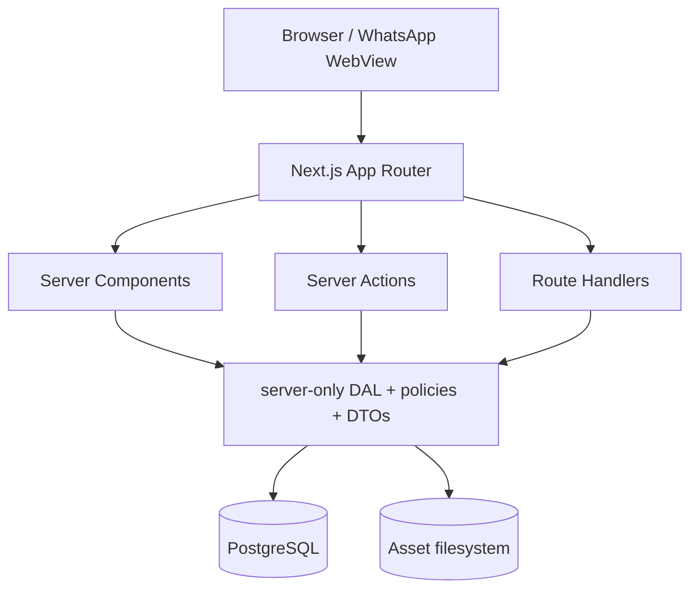
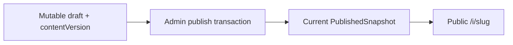
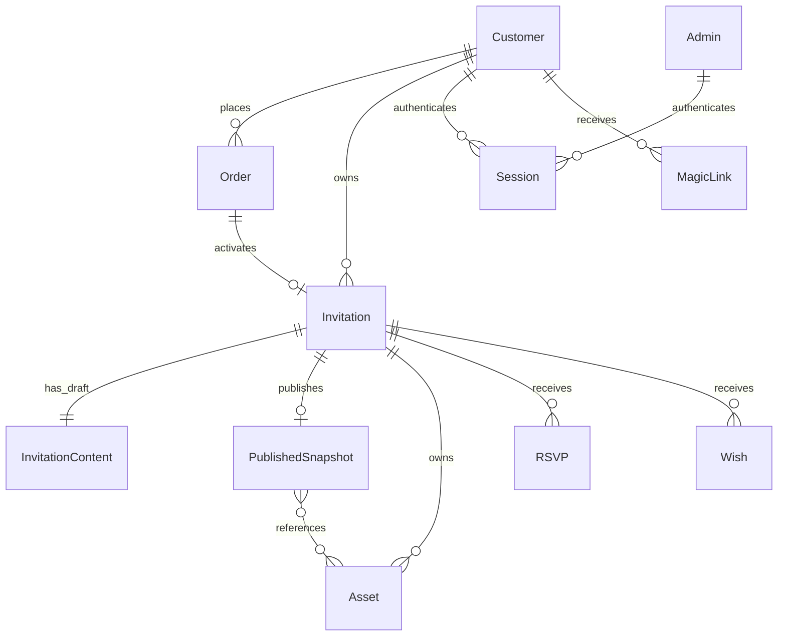
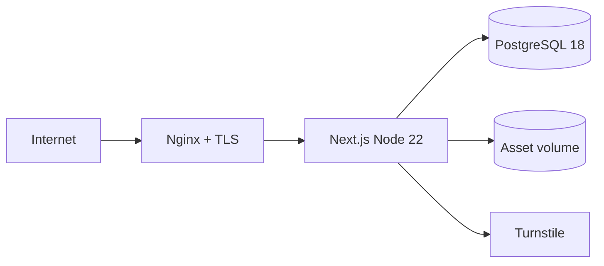
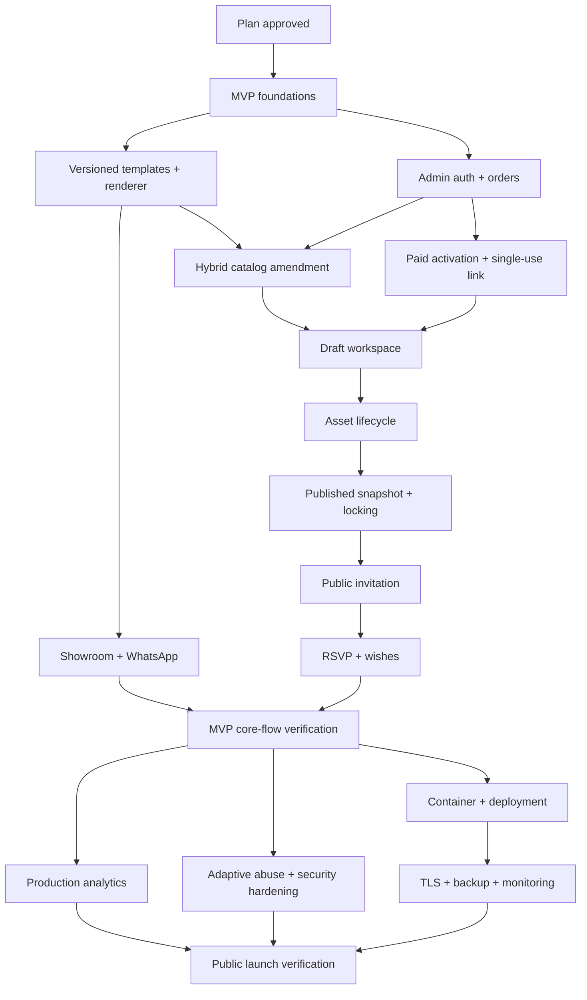

# Implementation Plan: Undango

**Status:** Approved - MVP-01 through MVP-18 complete; template catalog amendment pending implementation  
**Versi:** 0.4  
**Tanggal:** 4 Agustus 2026  
**Disetujui:** 4 Agustus 2026 oleh product owner  
**Specification:** [`docs/PRD.md`](../docs/PRD.md) v0.5 Approved  
**Task checklist:** [`tasks/todo.md`](./todo.md)  
**Supplemental plan:** [`tasks/template-catalog-plan.md`](./template-catalog-plan.md)  

## 1. Guardrail

Dokumen ini mencakup roadmap lengkap, tetapi delivery dipisahkan menjadi dua gate:

1. **Phase 1 - MVP Core Flow:** membuktikan alur produk pada development/staging.
2. **Phase 2 - Production Readiness:** membuat hasil MVP aman dan operable untuk public launch.

Approval plan tidak otomatis mengizinkan implementation. `MVP-01` - `MVP-18` tetap tercatat selesai dan approved. Amandemen `MVP-CAT-01` - `MVP-CAT-06` mencatat remediation baru tanpa menulis ulang evidence completion task lama; amendment harus selesai sebelum `MVP-19` dan MVP Gate. Tidak ada task Phase 2 yang menjadi syarat untuk menyatakan core flow MVP selesai, tetapi public launch dilarang sampai Production Readiness selesai.

## 2. Delivery Definition

### 2.1 MVP Core Flow

Target journey:

> Pengunjung memilih template -> admin mengaktifkan order -> customer mengisi draft -> admin publish -> tamu membuka invitation dan memberikan respons.

MVP wajib memiliki security/data-integrity minimum yang tidak aman ditunda:

- Server-side validation, authentication, authorization, dan ownership checks.
- Hashed single-use magic token, revocable database session, dan secure cookie.
- Explicit state transitions, database constraints, atomic activation/publish, dan idempotency.
- Template/content version pinning serta immutable current published snapshot.
- Asset lifecycle, upload validation, cleanup, reference protection, dan 250 MB quota.
- Automated tests untuk core rules dan core journey.

MVP selesai pada development/staging. MVP belum dianggap siap menerima traffic publik.

### 2.2 Production Readiness

Phase ini menambahkan:

- Security hardening, full authorization matrix, CSP/HSTS, audit, dan threat review.
- Adaptive CAPTCHA serta production-grade abuse controls.
- Advanced analytics dashboard dan query hardening.
- Containerization, CI/deployment pipeline, Nginx, TLS, secret management, dan rollback.
- Automated backup, off-host copy, restore drill, disk monitoring, health checks, dan alerting.
- Customer PIN recovery hanya jika kebutuhan support terbukti.
- Full browser/device/performance verification dan public-launch approval.

## 3. Architecture Decisions

Keputusan berikut sudah disetujui untuk plan ini.

| Area | Decision | Delivery phase |
|---|---|---|
| Runtime | Node.js 22.12+, Next.js 16.2.12 App Router, React 19.2.4 | MVP |
| Database | PostgreSQL 18 current minor | MVP |
| ORM | Prisma ORM 7.6 dengan `@prisma/adapter-pg`; production memakai `prisma migrate deploy` | MVP |
| Shape | Modular monolith; satu Next.js app dan satu PostgreSQL database | MVP |
| Data access | `server-only` DAL, authorization policy, dan minimal DTO | MVP |
| Mutation | Server Actions untuk authenticated UI; Route Handlers untuk HTTP/public boundaries | MVP |
| Validation | Shared schemas pada FormData, params, uploads, provider responses, dan public payload | MVP |
| Customer auth | Single-use magic link -> revocable opaque database session 24 jam | MVP |
| Admin auth | Email/password untuk dashboard admin -> revocable session 24 jam; no public registration | MVP |
| Customer link delivery | Dashboard generates single-use link; admin copies and sends it manually through WhatsApp | MVP |
| Recovery email | External email provider only if automated recovery is approved | Production Readiness, conditional |
| Templates | Hybrid versioned catalog: runtime manifest source-controlled, metadata bisnis database-controlled, exact key/version resolver, breaking runtime change membuat version baru | MVP |
| Content | Mutable draft + one immutable current published snapshot; no full history | MVP |
| Assets | Filesystem storage, explicit lifecycle, 250 MB ready quota per invitation | MVP |
| Analytics | Basic first-party catalog/detail/palette/WhatsApp events, no PII/cookie/IP | MVP |
| Abuse | Validation, basic rate limit, honeypot, idempotency | MVP |
| Advanced analytics | Admin aggregates, date filters, query/index hardening | Production Readiness |
| Adaptive abuse | Cloudflare Turnstile and operational security events | Production Readiness |
| Deployment | Docker Compose, Nginx + Certbot, PostgreSQL private network | Production Readiness |
| Operations | Backup, restore, disk monitoring, health, alerting, rollback | Production Readiness |
| Testing | Vitest + Testing Library; Playwright against production build | MVP, expanded in Production Readiness |

## 4. Logical Application Boundaries



Rules:

- Server Components read directly through DAL; they do not call internal Route Handlers.
- Server Actions and Route Handlers are public attack surfaces and repeat auth, authorization, ownership, and validation.
- Prisma records never cross into Client Components; safe DTO/view models do.
- `src/app` owns routing/composition. Domain code lives under `src/features/*`; shared server infrastructure under `src/lib/server/*`.

## 5. Data and Lifecycle Design

### 5.1 Hybrid Template Catalog and Versioning

Each source-controlled runtime manifest exposes `templateKey`, `templateVersion`, `contentSchemaVersion`, stable palette keys/tokens, content schema, capabilities, demo content, renderer, and any preview style that selects code behavior.

Each database catalog record owns public slug, name, category, description, current price, marketing thumbnail, display order, lifecycle status, and audit actor/time. A server-only resolver joins both records using exact `(templateKey, templateVersion)` identity. Catalog, detail, WhatsApp, and order intake consume only resolved DTOs.

Invitation and published snapshot persist `templateKey`, `templateVersion`, `contentSchemaVersion`, and `paletteKey`. Order also persists current price as an immutable snapshot.

Rules:

- `(templateKey, templateVersion)` is immutable and is the only code/database join contract.
- Non-breaking visual fixes may update an existing runtime version only when output contract and content interpretation stay compatible.
- Any breaking layout/content/schema change creates a new template or schema version.
- Runtime versions referenced by any order, invitation, or published snapshot cannot disappear.
- Runtime without metadata remains unavailable until reconciliation inserts a `DRAFT` catalog record.
- Visible metadata without exact runtime support fails closed and blocks deployment; there is no source metadata fallback.
- Catalog status follows `DRAFT -> VISIBLE -> HIDDEN|RETIRED`; hidden/retired records remain available to historical operations.
- Slug is freely editable before first visibility; later changes retain permanent aliases and retired slugs are never reused.
- Full content migration tooling is deferred; old renderer versions remain available.

### 5.2 Draft and Published Snapshot



- Workspace always reads/writes draft.
- Initial publish atomically creates/replaces one `PublishedSnapshot` and locks editing access.
- Admin can reopen editing while Invitation remains `published`; old snapshot remains public.
- Republish atomically replaces current snapshot and locks editing again.
- Explicit unpublish changes status to `draft` and takes public route offline.
- No prior snapshot history or rollback UI in MVP.

Published snapshot includes content and referenced asset IDs. Asset files referenced by current snapshot cannot be removed even if removed from draft; cleanup happens only after republish/archive makes them unreferenced.

### 5.3 Order and Invitation State

Order states:

```text
pending -> paid -> activated
pending -> cancelled
paid -> refunded
activated -> refunded
```

Invitation states:

```text
draft -> published
published -> published  (republish current snapshot)
published -> draft      (explicit unpublish)
draft|published -> archived
```

Editing access is separate from Invitation status. Only admin can change editing access or public status.

### 5.4 Database Enforcement

Application policies and PostgreSQL protection both apply:

- Unique `Invitation.orderId` guarantees one order activates at most one invitation.
- Unique normalized invitation slug.
- PostgreSQL enums/checks constrain known states and nonnegative content/storage versions.
- Transition triggers reject disallowed Order/Invitation state changes.
- Activation transaction locks paid Order, inserts Invitation idempotently, and sets Order `activated`; database trigger rejects non-paid activation.
- Draft save uses compare-and-swap `WHERE contentVersion = expectedVersion`.
- Publish transaction validates draft, replaces snapshot, updates status/lock, and commits atomically.
- Guest submissions use client-generated idempotency key with invitation-scoped unique constraint.

### 5.5 Core Entities



## 6. Authentication Plan

### 6.1 Session

- Raw opaque session token contains at least 256 bits entropy.
- Browser stores raw token in `HttpOnly`, `Secure` outside localhost, `SameSite=Lax`, `Path=/` cookie.
- Database stores token hash, actor type/ID, expiry, revoke time, and last-used time.
- Every protected read/write revalidates session and ownership/role through DAL.
- Logout and admin revoke invalidate server record and cookie.

### 6.2 Customer Magic Link

- Token is single-use, hashed at rest, expires after 24 hours, and can be revoked before use.
- Admin copies the generated link from dashboard and sends it manually through WhatsApp; no email provider is required for MVP.
- GET shows confirmation only; POST exchange atomically consumes token and creates session.
- Concurrent/replayed POST produces exactly one session success.
- Confirmation uses `Referrer-Policy: no-referrer`; raw token is excluded from app logs, analytics, audit payload, and later production proxy logs.
- If expired/used, admin issues a new link. Customer PIN recovery is not MVP.

### 6.3 Admin Login

- This login exists only for the admin dashboard. Admin does not log in to customer workspace and edits customer invitations through admin routes.
- Admin email is unique and normalized; there is no public admin registration.
- Password length is 12-128 characters and only an Argon2id hash is stored. Plaintext password never enters repository, logs, analytics, or audit payloads.
- Login response is generic and limited to 5 failed attempts per 15 minutes per account/network key.
- Successful verification creates revocable admin session 24 hours; secure operations re-read active admin role from database.
- MVP password reset is an authenticated operator procedure. Public forgot-password and email recovery are deferred.

## 7. Asset Lifecycle

```text
pending -> processing -> ready
pending|processing -> failed
ready|failed -> deleted
```

Upload flow:

1. Create `pending` Asset row and temporary path.
2. Stream upload with request/file-size limit.
3. Verify magic bytes, image dimensions or audio duration, and invitation ownership.
4. Move to `processing`; create normalized variants in temporary location.
5. Atomically move final files and set `ready` with exact byte size.
6. On failure, set `failed` and idempotently remove temporary/partial files.

Limits:

- Image: JPEG/PNG/WebP, 10 MB upload, max 2560 px processed dimension.
- Audio: MP3/M4A, 15 MB, max 10 minutes.
- Photo count: order snapshot.
- Total `ready` bytes: 250 MB per invitation.
- Only `ready` assets may enter draft/published content.
- Asset referenced by current published snapshot cannot transition to physically deleted.

MVP includes request-time cleanup and retryable cleanup command for stale temporary/failed assets. Scheduled cleanup, disk alerts, and host-level monitoring are Production Readiness.

## 8. Analytics Split

### MVP

- Store basic first-party events needed to validate showroom conversion: catalog viewed, detail viewed, palette selected, and WhatsApp clicked.
- Allowlisted properties only; no cookie, fingerprint, raw IP, email, guest name, or content.
- Analytics failure never blocks primary CTA.

### Production Readiness

- Add admin metrics dashboard, date ranges, activation/publish durations, guest engagement, query indexes, and table-growth policy.
- Establish 30-day baseline, then product owner sets target conversion and delivery metrics.

## 9. Abuse and Security Split

### MVP Minimum

- Server validation and output encoding.
- Ownership/role checks at DAL boundary.
- Basic rate limits for admin password login, magic exchange, RSVP, wish, analytics, and upload.
- Honeypot/minimum-fill-time for guest forms.
- Idempotency for activation, publish, guest writes, and email send retry.
- Safe structured errors and no secret/PII logging.

### Production Readiness

- Nginx connection/body/rate limits.
- HMAC pseudonymous rate identifiers and security event retention.
- Cloudflare Turnstile escalation for suspicious traffic.
- CSP, HSTS, permissions/referrer/frame/content-type policies.
- Full authorization matrix, dependency audit, threat review, and penetration-style abuse tests.

## 10. Production Topology

Production topology is planned now but implemented only in Phase 2.



- Docker Compose runs one app instance and PostgreSQL on a private network.
- Nginx is the only public ingress; Certbot handles TLS.
- Persistent volumes store database and `/srv/undango/assets`.
- Secrets live only on VPS with restricted permissions.
- Release applies backup, `prisma migrate deploy`, app start/readiness, smoke test, and image rollback.
- Database migrations are forward-only; destructive changes use expand-contract steps.

## 11. Backup and Operations

Production Readiness target:

- Nightly `pg_dump` plus asset snapshot, seven daily local copies.
- Weekly encrypted off-host copy to owner-controlled machine.
- Restore drill before public launch and monthly after launch.
- Disk warning at 70%, critical at 85%, and new upload block at 90%.
- Separate liveness/readiness checks and operational alerts.
- Backup on same VPS alone does not satisfy launch gate.

## 12. Dependency Graph



## 13. Task Map

Detailed acceptance criteria and verification commands live in `tasks/todo.md`.

### Phase 1 - MVP Core Flow

| Workstream | Tasks | Outcome |
|---|---|---|
| Foundation | `MVP-01` - `MVP-04` | ADRs, test harness, Prisma, constrained core schema |
| Showroom | `MVP-05` - `MVP-11` | Three versioned templates, catalog/detail/palette, WhatsApp, basic events |
| Operations | `MVP-12` - `MVP-18` | Admin credential/session, customers/orders, activation, manual WhatsApp single-use access |
| Template catalog amendment | `MVP-CAT-01` - `MVP-CAT-06` | Preserve completed MVP evidence while remediating runtime/catalog ownership, metadata operations, and drift checks |
| Workspace | `MVP-19` - `MVP-24` | Versioned draft forms, preview, image/music asset lifecycle |
| Publish and guests | `MVP-25` - `MVP-29` | Snapshot publish/republish, locked editing, public route, RSVP/wishes management |
| MVP acceptance | `MVP-30` | Entire core journey passes on development/staging |

### MVP Gate

- Core journey passes Playwright and focused integration tests.
- Database constraints, template pinning, snapshot isolation, auth replay defense, asset cleanup/quota, and guest idempotency pass.
- Hybrid catalog verification proves database metadata, source runtime contracts, immutable price snapshots, slug aliases, and fail-closed drift behavior.
- Three templates pass mobile/desktop visual and license review.
- `pnpm lint`, `pnpm typecheck`, `pnpm test`, `pnpm test:integration`, `pnpm build`, and MVP E2E pass.
- Human marks MVP validated. Public launch remains blocked.

### Phase 2 - Production Readiness

| Workstream | Tasks | Outcome |
|---|---|---|
| Product operations | `PR-01` - `PR-02` | Advanced analytics and conditional customer recovery |
| Security | `PR-03` - `PR-04` | Adaptive abuse controls and complete hardening |
| Deployment | `PR-05` - `PR-07` | Containers, CI/release pipeline, Nginx/TLS |
| Reliability | `PR-08` - `PR-09` | Backup/restore, disk/health monitoring, alerts |
| Launch | `PR-10` - `PR-11` | Browser/device/performance verification and public-launch gate |

### Production Readiness Gate

- No unresolved reachable critical/high security issue.
- TLS, secret management, backup restore, disk alerts, health checks, deployment, and rollback drills pass.
- Adaptive abuse controls work with provider failure handling.
- Full supported-browser/device suite passes against production-like deployment.
- Human explicitly approves public launch.

## 14. Parallelization

Safe after shared contracts:

- `MVP-09` and `MVP-10` can run in parallel after first renderer contract.
- Showroom UI and admin-auth foundation can run in parallel after schema foundation.
- RSVP and wishes can run in parallel after public snapshot route.
- `PR-01`, `PR-03`, and `PR-05` can begin independently after MVP Gate.

Sequential requirements:

- Prisma migrations touching same schema.
- Template version contract before any template implementation.
- `MVP-CAT-01` - `MVP-CAT-06` before `MVP-19`; workspace must consume the final runtime/catalog contract rather than the superseded combined definition.
- Admin auth before protected order operations.
- Paid activation before customer access.
- Draft/asset model before published snapshot.
- MVP Gate before any Production Readiness task is considered required.
- Deployment foundation before TLS, backup, and production smoke tests.

## 15. Risks and Mitigations

| Risk | Phase | Mitigation |
|---|---|---|
| Template code changes break active invitation | MVP | Pin template/schema version; retain old renderer; breaking changes create new version |
| Database metadata and deployed runtime drift | MVP | Exact key/version resolver, idempotent reconciliation, fail-closed public/order reads, deployment reference scan |
| Template slug change breaks saved showroom links | MVP | Immutable first-publication history, permanent slug alias, no retired slug reuse |
| Catalog price change mutates historical order | MVP | Current price from catalog metadata; immutable price snapshot copied into each order |
| Magic link replay | MVP | Single-use atomic consume, hash at rest, expiry/revoke, no token logs |
| Published invitation changes during customer edit | MVP | Separate draft/current snapshot; public reads snapshot only; admin republish atomically |
| Order activated twice or from wrong state | MVP | Unique order relation, locked transaction, DB trigger, idempotency key |
| DB and filesystem diverge | MVP | Asset state machine, temp paths, atomic rename, failure cleanup, reconciliation tests |
| VPS storage growth | MVP/PR | 250 MB quota in MVP; disk monitoring and upload block in PR |
| Public spam | MVP/PR | Basic rate/honeypot in MVP; Turnstile and proxy limits in PR |
| Admin password compromise or auth defect | MVP | Argon2id, 12-character minimum, generic errors, rate limits, database sessions, and focused tests |
| Data loss | PR | Automated local/off-host backup and restore drills before launch |
| Single VPS downtime | PR | Health/restart/rollback procedures; HA remains outside current plan |
| Scope creep | Both | Explicit task prefixes, MVP Gate, PR Gate, <=5 files per task |

## 16. Inputs Required Before Tasks

| Input | Default/proposal | Required before |
|---|---|---|
| Launch template concepts | Three concepts with visual references and licenses | `MVP-05` |
| Initial admin credential | One owner-controlled email; password supplied interactively/operator secret and hashed before storage | `MVP-12` |
| Wish delete semantics | Hard delete content after explicit confirmation; retain content-free audit event | `MVP-28` |
| Customer recovery evidence | Admin-issued WhatsApp magic link remains default; automated email recovery only if measured need | `PR-02` |
| VPS baseline | Linux x86_64, 2 vCPU, 4 GB RAM, 40 GB disk | `PR-05` |
| Git remote/CI | Private GitHub repository and GitHub Actions free tier | `PR-06` |
| Production domain | One app domain with DNS access | `PR-07` |
| Turnstile | Cloudflare Turnstile free tier | `PR-03` |
| Off-host backup target | Encrypted copy to owner-controlled machine | `PR-08` |

## 17. Verification Sources

- Local Next.js 16.2.12 docs: project structure, mutations, Route Handlers, auth, data security, analytics, testing, self-hosting, environment variables, and production checklist.
- Prisma ORM 7.6 docs: Node.js requirement, PostgreSQL driver adapter, connection reuse, and `prisma migrate deploy`.
- PostgreSQL support policy current 2 August 2026: PostgreSQL 18 supported through November 2030.

## 18. Approval Gate

- [x] Human approves two-phase split and architecture decisions.
- [x] Human accepts defaults in Section 16.
- [x] Human approves task scopes/order in `tasks/todo.md`.
- [x] Human approves hybrid versioned catalog amendment and slug alias lifecycle on 4 August 2026.
- [x] Plan status is `Approved` with reviewer/date.
- [x] `MVP-01` - `MVP-18` completion remains preserved; amendment tasks are tracked separately.
- [x] Product owner gave separate explicit instruction before `MVP-CAT-02` implementation began.
