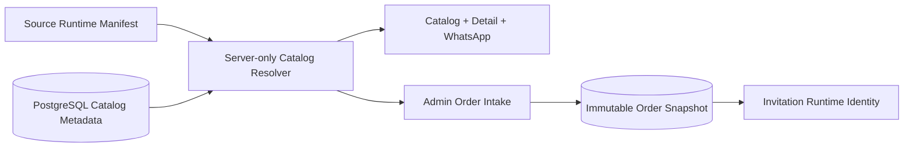

# Supplemental Implementation Plan: Hybrid Versioned Template Catalog

**Status:** Approved specification; MVP-CAT-03 implementation completed and verified  
**Date:** 4 August 2026  
**Approved by:** Product owner  
**Specification:** [`docs/PRD.md`](../docs/PRD.md) v0.5  
**Decision:** [`ADR-0007`](../docs/decisions/0007-hybrid-versioned-template-catalog.md)  
**Master plan:** [`tasks/plan.md`](./plan.md) v0.4  
**Task checklist:** [`tasks/todo.md`](./todo.md), `MVP-CAT-01` - `MVP-CAT-06`  

## 1. Objective

Remediate completed showroom/admin/order work so business metadata is editable in PostgreSQL while renderer compatibility remains versioned with source code. Preserve evidence that `MVP-01` - `MVP-18` were completed and approved; this plan tracks only consequences of the later architecture amendment.

Success means:

- Admin changes catalog metadata without deploying code.
- Source code remains sole authority for renderer/schema/capability/palette/demo contracts.
- Public and order surfaces never read metadata directly from runtime definitions.
- Exact `(templateKey, templateVersion)` pairs are required; drift fails closed.
- Existing order price and template snapshots never change after metadata edits.

## 2. Ownership Contract

| Owner | Fields |
|---|---|
| Source runtime manifest | `templateKey`, `templateVersion`, `contentSchemaVersion`, renderer, content schema, capabilities, palette keys/tokens, demo content, code-selecting preview style |
| Database catalog | public name, slug/aliases, category, description, current price, marketing thumbnail, display order, lifecycle status, audit actor/time |
| Order snapshot | exact template/schema/palette identity, agreed price, photo limit, storage quota |
| Invitation/published snapshot | exact template/schema/palette identity and content snapshot |

No field has two active authorities. Source defaults may bootstrap a new database record once, but runtime requests never fall back to source metadata after migration.

## 3. Target Boundaries



Rules:

- Client Components receive resolved DTOs, never Prisma rows or renderer objects together.
- Template renderers do not access the database.
- Server Actions validate metadata input and re-check active admin identity.
- Resolver distinguishes `NOT_FOUND`, `NOT_VISIBLE`, `MISSING_RUNTIME`, and `INCOMPATIBLE_RUNTIME` internally; public routes collapse unavailable states to not-found.
- New orders accept only `VISIBLE` and runtime-compatible catalog records.
- Resolved DTO preserves nullable `marketingThumbnail`; when null, showroom may render runtime preview as presentation-only behavior without synthesizing or persisting metadata.

## 4. Data Model Direction

### TemplateCatalog

- Surrogate UUID primary key.
- Unique `(templateKey, templateVersion)` runtime identity.
- Unique current slug.
- Name, description, current price, marketing thumbnail, display order.
- Category relation.
- Lifecycle status: `DRAFT`, `VISIBLE`, `HIDDEN`, `RETIRED`.
- Last updating admin and timestamps.
- Nonnegative checks for price and display order.

### TemplateCategory

- Stable unique key.
- Editable display name/order and active flag.
- Inactive categories remain readable for historical metadata.

### TemplateSlugAlias

- Globally unique historical slug.
- Relation to one catalog record.
- Alias never reassigned or hard-deleted after publication.

### Migration behavior

- Convert all three launch definitions into initial catalog rows.
- Preserve effective visibility from existing `TemplateVisibility` overrides.
- Preserve existing slugs, names, descriptions, prices, categories, and display order in deterministic migration/bootstrap input.
- Do not mutate Order, Invitation, or PublishedSnapshot identity/price fields.
- Retire `TemplateVisibility` only after catalog reads and admin writes have moved.

## 5. Reconciliation and Deployment

Reconciliation command behavior:

1. Load every shipped runtime manifest.
2. Insert missing catalog identity as `DRAFT` with explicit bootstrap metadata.
3. Validate existing catalog identity/schema compatibility.
4. Never overwrite admin-owned fields.
5. Report runtime-only, metadata-only, incompatible palette/schema, duplicate slug, and referenced-missing-runtime conditions.
6. Exit nonzero for any drift that could break public/order/historical rendering.

Release sequence:

1. Deploy additive runtime support.
2. Apply structure migration.
3. Reconcile catalog metadata.
4. Validate and expose metadata through admin.
5. Enable visibility only after resolver checks pass.
6. Hide/retire before runtime retirement.
7. Remove runtime only after database reference scan proves zero references.

Rollback must test previous application binary against current catalog schema and retain every referenced renderer version.

## 6. Ordered Delivery

### Phase A: Foundation

#### MVP-CAT-01: Decision and impact register

Completed by this documentation amendment. No code changes belong in this task.

#### MVP-CAT-02: Database catalog foundation

Implementation order:

1. Write migration/reconciliation failure tests.
2. Add catalog/category/alias schema and constraints.
3. Migrate current effective metadata and visibility.
4. Add idempotent reconciliation command.
5. Verify clean database, current development database, and second reconciliation run.

Checkpoint A:

- Existing metadata preserved.
- No admin edits overwritten by reconciliation.
- Existing order/invitation rows unchanged.
- Prisma validation and migration tests pass.

### Phase B: Runtime Resolution

#### MVP-CAT-03: Runtime manifest and resolver

Implementation order:

1. Write contract tests that reject duplicate runtime identities and mutable compatibility fields.
2. Split runtime-only types from catalog DTO types.
3. Remove business metadata authority from runtime definitions.
4. Add exact server-only resolver and typed unavailable states.
5. Add reference scan for orders, invitations, and published snapshots.

Checkpoint B:

- [x] Renderer tests still pass unchanged.
- [x] Runtime-only and metadata-only pairs fail closed.
- [x] Exact palette/schema compatibility is checked.
- [x] Active references to missing runtime fail verification.

### Phase C: Operations and Public Surfaces

#### MVP-CAT-04: Admin metadata management

- Build validated metadata form with inline errors, pending state, toast, audit, and cache revalidation.
- Runtime identity/schema/renderer/capabilities/palettes/demo are read-only.
- Slug first-publication and permanent alias rules are enforced server-side.

#### MVP-CAT-05: Showroom and WhatsApp integration

- Catalog/detail/alias routes consume resolved DTOs.
- Current database name/category/description/price/order/visibility drive public output.
- Exact source renderer/palette/demo drive preview output.
- Hidden, retired, missing-runtime, and incompatible records never leak internal state.

Checkpoint C:

- Metadata edits appear without deployment.
- Slug aliases redirect safely.
- WhatsApp uses current catalog name/price/slug.
- No source metadata fallback remains.

### Phase D: Orders and Drift Gate

#### MVP-CAT-06: Order snapshots and release verification

- Order selector lists only orderable resolved templates.
- Server re-resolves submitted identity before create.
- Current database price is copied into immutable order snapshot.
- Concurrent metadata changes cannot produce a mixed identity/price snapshot.
- Deployment drift/reference scan becomes required verification.

Checkpoint D:

- Price edit affects new orders only.
- Old order and invitation snapshots remain unchanged.
- Retired/invalid template submissions fail safely.
- Rollback and reference scan pass.

## 7. Test Strategy

Focused tests first for each task.

| Level | Evidence |
|---|---|
| Unit | Runtime manifest uniqueness, resolver state mapping, metadata schemas, slug lifecycle, price formatting |
| Component | Admin metadata errors/toasts/pending, catalog DTO rendering, category filtering |
| Integration | Existing/empty migration, reconciliation idempotency, visibility preservation, price snapshot, audit, reference scan |
| E2E | Metadata edit -> showroom/detail/WhatsApp; slug alias; hidden/retired behavior; new vs old order price |

Final commands:

```text
pnpm exec prisma validate
pnpm lint
pnpm typecheck
pnpm test
pnpm test:integration
pnpm build
pnpm test:e2e -- --grep "template catalog"
```

## 8. Risks and Mitigations

| Risk | Impact | Mitigation |
|---|---|---|
| Migration loses effective visibility | Hidden template becomes public | Migrate computed visibility; integration fixture for every launch template |
| Reconciliation overwrites admin metadata | Operational data loss | Insert-only defaults; compare/report existing values; never blind upsert editable fields |
| Metadata deployed before runtime | Public/order render failure | `DRAFT` default, exact resolver, nonzero deployment drift check |
| Runtime removed while referenced | Historical invitation failure | Reference scan and additive runtime retention |
| Price changes old orders | Commercial inconsistency | Immutable `Order.priceInRupiah`; historical views use snapshot |
| Slug rename breaks links | Lost traffic/WhatsApp links | Permanent alias and no slug reuse |
| Palette contract drifts | Invalid preview/invitation | Palette keys/tokens remain source-controlled and version-pinned |
| Previous task status becomes ambiguous | Agents repeat or skip work | Explicit impact register maps completed tasks to remediation tasks |

## 9. Boundaries

Always:

- Preserve `MVP-01` - `MVP-18` completion history.
- Write migration and drift tests before changing data ownership.
- Keep runtime versions additive while referenced.
- Preserve order price snapshots.
- Fail closed on missing or incompatible pairs.

Never:

- Add silent source metadata fallback.
- Let admin edit renderer identity, version, schema, capabilities, palette tokens, or demo content.
- Reuse a public slug.
- Blind-upsert admin metadata from reconciliation.
- Delete referenced runtime versions or historical metadata.

## 10. Agent Start Condition

This plan and `MVP-CAT-01` are approved documentation. `MVP-CAT-02` implementation begins only after a separate explicit product-owner start instruction. Agent should execute tasks sequentially, update checklist state after verification, and stop before `MVP-19` until Checkpoint MVP-Catalog passes.
